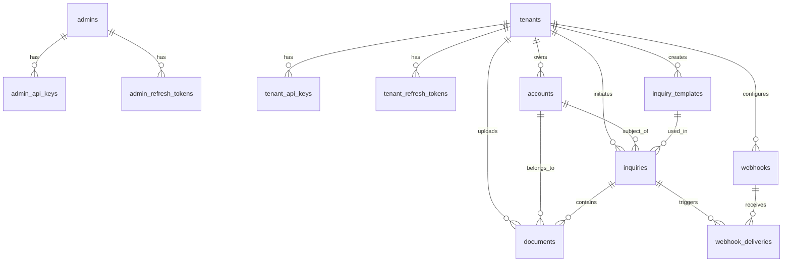

# Database Schema Documentation

## Overview

The KYC Adapter uses PostgreSQL with TypeORM for a multi-tenant architecture. The schema is designed to support multiple organizations (tenants) with secure authentication and future KYC verification capabilities.

## Core Entities

### Authentication & Authorization

#### `admins`
System administrators who manage the KYC adapter platform.

```sql
CREATE TABLE admins (
  id uuid PRIMARY KEY DEFAULT gen_random_uuid(),
  name varchar(255) NOT NULL,
  email varchar(255) UNIQUE NOT NULL,
  password varchar(255), -- bcrypt hashed
  role varchar(50) DEFAULT 'admin' CHECK (role IN ('super_admin', 'admin', 'viewer')),
  status varchar(50) DEFAULT 'active' CHECK (status IN ('active', 'inactive', 'suspended')),
  last_login_at timestamp with time zone,
  created_at timestamp with time zone DEFAULT now(),
  updated_at timestamp with time zone DEFAULT now()
);

-- Indexes
CREATE UNIQUE INDEX idx_admins_email ON admins(email);
CREATE INDEX idx_admins_status ON admins(status);
CREATE INDEX idx_admins_role ON admins(role);
```

**Roles:**
- `super_admin`: Full platform access, can create/delete tenants
- `admin`: Tenant management, cannot delete tenants  
- `viewer`: Read-only access to tenant information

#### `admin_api_keys`
API keys for admin authentication.

```sql
CREATE TABLE admin_api_keys (
  id uuid PRIMARY KEY DEFAULT gen_random_uuid(),
  admin_id uuid NOT NULL REFERENCES admins(id) ON DELETE CASCADE,
  name varchar(255) NOT NULL,
  key_hash varchar(64) UNIQUE NOT NULL, -- SHA-256 hash of API key
  status varchar(50) DEFAULT 'active' CHECK (status IN ('active', 'inactive', 'expired', 'revoked')),
  expires_at timestamp with time zone,
  last_used_at timestamp with time zone,
  created_at timestamp with time zone DEFAULT now(),
  updated_at timestamp with time zone DEFAULT now()
);

-- Indexes
CREATE INDEX idx_admin_api_keys_admin_id ON admin_api_keys(admin_id);
CREATE UNIQUE INDEX idx_admin_api_keys_key_hash ON admin_api_keys(key_hash);
CREATE INDEX idx_admin_api_keys_status ON admin_api_keys(status);
CREATE INDEX idx_admin_api_keys_admin_id_status ON admin_api_keys(admin_id, status);
CREATE INDEX idx_admin_api_keys_expires_at ON admin_api_keys(expires_at);
```

#### `admin_refresh_tokens`
JWT refresh tokens for admin authentication.

```sql
CREATE TABLE admin_refresh_tokens (
  id uuid PRIMARY KEY DEFAULT gen_random_uuid(),
  admin_id uuid NOT NULL REFERENCES admins(id) ON DELETE CASCADE,
  token varchar(255) UNIQUE NOT NULL,
  is_revoked boolean DEFAULT false,
  expires_at timestamp with time zone NOT NULL,
  user_agent text,
  ip_address varchar(45),
  created_at timestamp with time zone DEFAULT now()
);

-- Indexes
CREATE INDEX idx_admin_refresh_tokens_admin_id ON admin_refresh_tokens(admin_id);
CREATE UNIQUE INDEX idx_admin_refresh_tokens_token ON admin_refresh_tokens(token);
CREATE INDEX idx_admin_refresh_tokens_expires_at ON admin_refresh_tokens(expires_at);
```

#### `tenants`
Organizations/clients using the KYC adapter.

```sql
CREATE TABLE tenants (
  id uuid PRIMARY KEY DEFAULT gen_random_uuid(),
  name varchar(255) NOT NULL,
  email varchar(255) UNIQUE NOT NULL,
  password varchar(255), -- bcrypt hashed
  status varchar(50) DEFAULT 'active' CHECK (status IN ('active', 'inactive', 'suspended', 'pending')),
  settings jsonb DEFAULT '{}',
  created_at timestamp with time zone DEFAULT now(),
  updated_at timestamp with time zone DEFAULT now()
);

-- Indexes
CREATE UNIQUE INDEX idx_tenants_email ON tenants(email);
CREATE INDEX idx_tenants_status ON tenants(status);
```

**Settings Example:**
```json
{
  "maxApiKeys": 5,
  "allowedProviders": ["regula", "persona"],
  "rateLimits": {
    "perMinute": 100,
    "perHour": 1000
  }
}
```

#### `tenant_api_keys`
API keys for tenant authentication.

```sql
CREATE TABLE tenant_api_keys (
  id uuid PRIMARY KEY DEFAULT gen_random_uuid(),
  tenant_id uuid NOT NULL REFERENCES tenants(id) ON DELETE CASCADE,
  name varchar(255) NOT NULL,
  key_hash varchar(64) UNIQUE NOT NULL, -- SHA-256 hash of API key
  status varchar(50) DEFAULT 'active' CHECK (status IN ('active', 'inactive', 'expired', 'revoked')),
  expires_at timestamp with time zone,
  last_used_at timestamp with time zone,
  preview_suffix varchar(8), -- non-sensitive display suffix
  key_encrypted text,        -- AES-256-GCM ciphertext
  key_iv varchar(24),        -- base64 IV
  created_at timestamp with time zone DEFAULT now(),
  updated_at timestamp with time zone DEFAULT now()
);

-- Indexes
CREATE INDEX idx_tenant_api_keys_tenant_id ON tenant_api_keys(tenant_id);
CREATE UNIQUE INDEX idx_tenant_api_keys_key_hash ON tenant_api_keys(key_hash);
CREATE INDEX idx_tenant_api_keys_status ON tenant_api_keys(status);
CREATE INDEX idx_tenant_api_keys_tenant_id_status ON tenant_api_keys(tenant_id, status);
CREATE INDEX idx_tenant_api_keys_expires_at ON tenant_api_keys(expires_at);
```

#### `tenant_refresh_tokens`
JWT refresh tokens for tenant authentication.

```sql
CREATE TABLE tenant_refresh_tokens (
  id uuid PRIMARY KEY DEFAULT gen_random_uuid(),
  tenant_id uuid NOT NULL REFERENCES tenants(id) ON DELETE CASCADE,
  token varchar(255) UNIQUE NOT NULL,
  is_revoked boolean DEFAULT false,
  expires_at timestamp with time zone NOT NULL,
  user_agent text,
  ip_address varchar(45),
  created_at timestamp with time zone DEFAULT now()
);

-- Indexes
CREATE INDEX idx_tenant_refresh_tokens_tenant_id ON tenant_refresh_tokens(tenant_id);
CREATE UNIQUE INDEX idx_tenant_refresh_tokens_token ON tenant_refresh_tokens(token);
CREATE INDEX idx_tenant_refresh_tokens_expires_at ON tenant_refresh_tokens(expires_at);
CREATE INDEX idx_tenant_refresh_tokens_tenant_id_is_revoked ON tenant_refresh_tokens(tenant_id, is_revoked);
```

## Multi-Tenant KYC Entities

> Note: The current system uses `verifications` for KYC flows. The `inquiries`/`inquiry_templates` sections below are planned/future constructs.

#### `providers`
Registered KYC providers available in the system.

```sql
CREATE TABLE providers (
  id uuid PRIMARY KEY DEFAULT gen_random_uuid(),
  name varchar(100) UNIQUE NOT NULL, -- e.g., 'regula-mock', 'persona'
  capabilities jsonb DEFAULT '{}',
  is_active boolean DEFAULT true,
  created_at timestamp with time zone DEFAULT now(),
  updated_at timestamp with time zone DEFAULT now()
);

-- Indexes
CREATE UNIQUE INDEX idx_providers_name ON providers(name);
CREATE INDEX idx_providers_is_active ON providers(is_active);
```

#### `tenant_provider_configs`
Per-tenant provider assignments and configurations.

```sql
CREATE TABLE tenant_provider_configs (
  id uuid PRIMARY KEY DEFAULT gen_random_uuid(),
  tenant_id uuid NOT NULL REFERENCES tenants(id) ON DELETE CASCADE,
  provider_id uuid NOT NULL REFERENCES providers(id) ON DELETE CASCADE,
  config jsonb NOT NULL DEFAULT '{}',
  is_primary boolean DEFAULT false,
  priority integer DEFAULT 10,
  created_at timestamp with time zone DEFAULT now(),
  updated_at timestamp with time zone DEFAULT now(),
  UNIQUE (tenant_id, provider_id)
);

-- Indexes
CREATE INDEX idx_tpc_tenant ON tenant_provider_configs(tenant_id);
CREATE INDEX idx_tpc_provider ON tenant_provider_configs(provider_id);
CREATE INDEX idx_tpc_tenant_priority ON tenant_provider_configs(tenant_id, priority);
```

#### `verifications`
KYC verifications processed via configured providers.

```sql
CREATE TABLE verifications (
  id uuid PRIMARY KEY DEFAULT gen_random_uuid(),
  tenant_id uuid NOT NULL REFERENCES tenants(id) ON DELETE CASCADE,
  account_id uuid REFERENCES accounts(id) ON DELETE SET NULL,
  provider_name varchar(100) NOT NULL, -- e.g., 'regula-mock'
  provider_verification_id varchar(255),
  verification_type varchar(50) NOT NULL, -- document, biometric, comprehensive
  processing_method varchar(50) DEFAULT 'direct', -- direct, external_link
  status varchar(50) NOT NULL, -- pending, in_progress, completed, failed, expired, cancelled
  expires_at timestamp with time zone,
  result jsonb, -- standardized result
  request_metadata jsonb,
  response_metadata jsonb,
  created_at timestamp with time zone DEFAULT now(),
  updated_at timestamp with time zone DEFAULT now()
);

-- Indexes
CREATE INDEX idx_verifications_tenant ON verifications(tenant_id);
CREATE INDEX idx_verifications_tenant_status ON verifications(tenant_id, status);
CREATE INDEX idx_verifications_created_at ON verifications(created_at);
CREATE INDEX idx_verifications_provider ON verifications(provider_name);
```

#### `accounts`
KYC verification subjects (people being verified).

```sql
CREATE TABLE accounts (
  id uuid PRIMARY KEY DEFAULT gen_random_uuid(),
  tenant_id uuid NOT NULL REFERENCES tenants(id) ON DELETE CASCADE,
  reference_id varchar(255), -- Tenant's internal reference
  name jsonb, -- {first, middle, last}
  email varchar(255),
  phone varchar(50),
  birthdate date,
  address jsonb, -- {street, city, state, country, postalCode}
  created_at timestamp with time zone DEFAULT now(),
  updated_at timestamp with time zone DEFAULT now()
);

-- Indexes
CREATE INDEX idx_accounts_tenant_id ON accounts(tenant_id);
CREATE INDEX idx_accounts_tenant_id_reference_id ON accounts(tenant_id, reference_id);
CREATE INDEX idx_accounts_tenant_id_email ON accounts(tenant_id, email);
```

#### `inquiry_templates` (Future)
Verification flow templates for different use cases.

```sql
CREATE TABLE inquiry_templates (
  id uuid PRIMARY KEY DEFAULT gen_random_uuid(),
  tenant_id uuid NOT NULL REFERENCES tenants(id) ON DELETE CASCADE,
  name varchar(255) NOT NULL,
  description text,
  provider varchar(50) NOT NULL, -- 'regula', 'persona', etc.
  config jsonb NOT NULL, -- Provider-specific configuration
  is_active boolean DEFAULT true,
  created_at timestamp with time zone DEFAULT now(),
  updated_at timestamp with time zone DEFAULT now()
);

-- Indexes
CREATE INDEX idx_inquiry_templates_tenant_id ON inquiry_templates(tenant_id);
CREATE INDEX idx_inquiry_templates_tenant_id_is_active ON inquiry_templates(tenant_id, is_active);
CREATE INDEX idx_inquiry_templates_provider ON inquiry_templates(provider);
```

#### `inquiries` (Future)
Verification sessions/flows.

```sql
CREATE TABLE inquiries (
  id uuid PRIMARY KEY DEFAULT gen_random_uuid(),
  tenant_id uuid NOT NULL REFERENCES tenants(id) ON DELETE CASCADE,
  account_id uuid REFERENCES accounts(id) ON DELETE SET NULL,
  template_id uuid REFERENCES inquiry_templates(id) ON DELETE SET NULL,
  provider varchar(50) NOT NULL,
  provider_inquiry_id varchar(255), -- Provider's inquiry ID
  status varchar(50) DEFAULT 'pending', -- pending, in_progress, completed, failed, expired
  result jsonb, -- Standardized verification result
  provider_data jsonb, -- Raw provider response
  expires_at timestamp with time zone,
  completed_at timestamp with time zone,
  created_at timestamp with time zone DEFAULT now(),
  updated_at timestamp with time zone DEFAULT now()
);

-- Indexes
CREATE INDEX idx_inquiries_tenant_id ON inquiries(tenant_id);
CREATE INDEX idx_inquiries_account_id ON inquiries(account_id);
CREATE INDEX idx_inquiries_template_id ON inquiries(template_id);
CREATE INDEX idx_inquiries_status ON inquiries(status);
CREATE INDEX idx_inquiries_provider ON inquiries(provider);
CREATE INDEX idx_inquiries_tenant_id_status ON inquiries(tenant_id, status);
CREATE INDEX idx_inquiries_created_at ON inquiries(created_at);
```

#### `documents`
Uploaded verification documents.

```sql
CREATE TABLE documents (
  id uuid PRIMARY KEY DEFAULT gen_random_uuid(),
  tenant_id uuid NOT NULL REFERENCES tenants(id) ON DELETE CASCADE,
  account_id uuid REFERENCES accounts(id) ON DELETE CASCADE,
  inquiry_id uuid REFERENCES inquiries(id) ON DELETE CASCADE,
  type varchar(50) NOT NULL, -- passport, drivers_license, id_card, selfie
  file_path varchar(500),
  file_name varchar(255),
  file_size integer,
  mime_type varchar(100),
  metadata jsonb, -- File metadata, extraction results
  is_processed boolean DEFAULT false,
  created_at timestamp with time zone DEFAULT now()
);

-- Indexes
CREATE INDEX idx_documents_tenant_id ON documents(tenant_id);
CREATE INDEX idx_documents_account_id ON documents(account_id);
CREATE INDEX idx_documents_inquiry_id ON documents(inquiry_id);
CREATE INDEX idx_documents_type ON documents(type);
CREATE INDEX idx_documents_is_processed ON documents(is_processed);
```

#### `webhooks`
Webhook configurations for provider callbacks.

```sql
CREATE TABLE webhooks (
  id uuid PRIMARY KEY DEFAULT gen_random_uuid(),
  tenant_id uuid NOT NULL REFERENCES tenants(id) ON DELETE CASCADE,
  url varchar(500) NOT NULL,
  events text[] NOT NULL, -- Array of event types
  secret varchar(255), -- For webhook signature verification
  is_active boolean DEFAULT true,
  retry_config jsonb DEFAULT '{"maxRetries": 3, "backoff": "exponential"}',
  created_at timestamp with time zone DEFAULT now(),
  updated_at timestamp with time zone DEFAULT now()
);

-- Indexes
CREATE INDEX idx_webhooks_tenant_id ON webhooks(tenant_id);
CREATE INDEX idx_webhooks_tenant_id_is_active ON webhooks(tenant_id, is_active);
```

#### `webhook_deliveries`
Webhook delivery attempts and status.

```sql
CREATE TABLE webhook_deliveries (
  id uuid PRIMARY KEY DEFAULT gen_random_uuid(),
  webhook_id uuid NOT NULL REFERENCES webhooks(id) ON DELETE CASCADE,
  inquiry_id uuid REFERENCES inquiries(id) ON DELETE SET NULL,
  event_type varchar(100) NOT NULL,
  payload jsonb NOT NULL,
  status varchar(50) DEFAULT 'pending', -- pending, delivered, failed, retrying
  http_status integer,
  response_body text,
  attempt_count integer DEFAULT 0,
  next_attempt_at timestamp with time zone,
  delivered_at timestamp with time zone,
  created_at timestamp with time zone DEFAULT now()
);

-- Indexes
CREATE INDEX idx_webhook_deliveries_webhook_id ON webhook_deliveries(webhook_id);
CREATE INDEX idx_webhook_deliveries_inquiry_id ON webhook_deliveries(inquiry_id);
CREATE INDEX idx_webhook_deliveries_status ON webhook_deliveries(status);
CREATE INDEX idx_webhook_deliveries_next_attempt_at ON webhook_deliveries(next_attempt_at);
CREATE INDEX idx_webhook_deliveries_created_at ON webhook_deliveries(created_at);
```

## Entity Relationships



## Data Examples

### Default Admin
```sql
INSERT INTO admins (
  id, name, email, role, status, created_at
) VALUES (
  '73372879-3098-4a03-af0c-3c5a65d136e3',
  'Development Admin',
  'admin@kyc-adapter.dev',
  'super_admin',
  'active',
  now()
);
```

### Test Tenant
```sql
INSERT INTO tenants (
  id, name, email, status, settings, created_at
) VALUES (
  '77815e4c-a3e8-41fb-90c5-ed3aeb79f859',
  'Test Tenant',
  'test@kyc-adapter.dev',
  'active',
  '{"maxApiKeys": 5, "allowedProviders": ["regula", "persona"]}',
  now()
);
```

### API Key Example
```sql
-- Tenant API Key: kya_b8f7e4a1c9d6f2e8a5b3c7d9f1e4a6c8d2f5a7b9c3e6f8a1d4b7c9e2f5a8b1c4
INSERT INTO tenant_api_keys (
  tenant_id, name, key_hash, status, created_at
) VALUES (
  '77815e4c-a3e8-41fb-90c5-ed3aeb79f859',
  'Test API Key',
  sha256('kya_b8f7e4a1c9d6f2e8a5b3c7d9f1e4a6c8d2f5a7b9c3e6f8a1d4b7c9e2f5a8b1c4'),
  'active',
  now()
);
```

## Performance Optimizations

### Composite Indexes
```sql
-- Multi-column queries
CREATE INDEX idx_inquiries_tenant_status_created ON inquiries(tenant_id, status, created_at);
CREATE INDEX idx_documents_inquiry_type ON documents(inquiry_id, type);
CREATE INDEX idx_webhook_deliveries_webhook_status ON webhook_deliveries(webhook_id, status);
```

### Partial Indexes
```sql
-- Active records only
CREATE INDEX idx_tenants_active ON tenants(id) WHERE status = 'active';
CREATE INDEX idx_api_keys_active ON tenant_api_keys(tenant_id, key_hash) WHERE status = 'active';
CREATE INDEX idx_inquiries_pending ON inquiries(tenant_id, created_at) WHERE status = 'pending';
```

### JSONB Indexes
```sql
-- Settings queries
CREATE INDEX idx_tenants_settings_providers ON tenants USING gin ((settings->'allowedProviders'));
CREATE INDEX idx_inquiry_templates_config ON inquiry_templates USING gin (config);
```

## Database Functions

### Cleanup Functions
```sql
-- Clean expired tokens
CREATE OR REPLACE FUNCTION cleanup_expired_tokens()
RETURNS void AS $$
BEGIN
  DELETE FROM admin_refresh_tokens WHERE expires_at < now();
  DELETE FROM tenant_refresh_tokens WHERE expires_at < now();
END;
$$ LANGUAGE plpgsql;

-- Clean old webhook deliveries  
CREATE OR REPLACE FUNCTION cleanup_old_webhook_deliveries()
RETURNS void AS $$
BEGIN
  DELETE FROM webhook_deliveries 
  WHERE created_at < now() - interval '30 days'
  AND status IN ('delivered', 'failed');
END;
$$ LANGUAGE plpgsql;
```

### Audit Triggers
```sql
-- Update timestamps automatically
CREATE OR REPLACE FUNCTION update_updated_at()
RETURNS trigger AS $$
BEGIN
  NEW.updated_at = now();
  RETURN NEW;
END;
$$ LANGUAGE plpgsql;

-- Apply to relevant tables
CREATE TRIGGER update_admins_updated_at 
  BEFORE UPDATE ON admins
  FOR EACH ROW EXECUTE FUNCTION update_updated_at();

CREATE TRIGGER update_tenants_updated_at
  BEFORE UPDATE ON tenants  
  FOR EACH ROW EXECUTE FUNCTION update_updated_at();
```

## Migration Strategy

### Version Control
Migrations are numbered sequentially:
- `1700000001000-CreateInitialSchema.ts` - Core multi-tenant schema
- `1753551303470-CreateAdminSchema.ts` - Admin authentication
- `1753553959936-AddAdminPasswordAndRefreshTokens.ts` - Admin JWT
- `1753557000000-AddTenantPasswordAndRefreshTokens.ts` - Tenant JWT

### Rollback Strategy
Each migration includes a `down()` method for safe rollbacks:
```typescript
public async down(queryRunner: QueryRunner): Promise<void> {
  await queryRunner.query(`DROP TABLE IF EXISTS "tenant_refresh_tokens"`);
  await queryRunner.query(`ALTER TABLE "tenants" DROP COLUMN IF EXISTS "password"`);
}
```

## Security Considerations

### Sensitive Data
- **Passwords**: bcrypt hashed with 12 salt rounds
- **API Keys**: SHA-256 hashed before storage
- **Provider Credentials**: Encrypted using `pgcrypto` extension

### Row-Level Security (Future)
```sql
-- Tenant data isolation
ALTER TABLE accounts ENABLE ROW LEVEL SECURITY;

CREATE POLICY tenant_isolation ON accounts
  FOR ALL
  TO application_role
  USING (tenant_id = current_setting('app.current_tenant_id')::uuid);
```

### Backup Strategy
- **Full Backup**: Daily at 2 AM UTC
- **Point-in-Time Recovery**: WAL archiving enabled
- **Encryption**: Backups encrypted with AES-256

## Monitoring Queries

### Performance Monitoring
```sql
-- Top slow queries
SELECT query, calls, total_time, mean_time 
FROM pg_stat_statements 
ORDER BY mean_time DESC LIMIT 10;

-- Index usage
SELECT schemaname, tablename, indexname, idx_scan, idx_tup_read, idx_tup_fetch
FROM pg_stat_user_indexes 
ORDER BY idx_scan DESC;

-- Table sizes
SELECT 
  schemaname,
  tablename,
  pg_size_pretty(pg_total_relation_size(schemaname||'.'||tablename)) as size
FROM pg_tables 
WHERE schemaname = 'public'
ORDER BY pg_total_relation_size(schemaname||'.'||tablename) DESC;
```

### Health Checks
```sql
-- Active connections
SELECT count(*) as active_connections 
FROM pg_stat_activity 
WHERE state = 'active';

-- Database size
SELECT pg_size_pretty(pg_database_size(current_database()));

-- Replication lag (if applicable)
SELECT 
  client_addr,
  state,
  pg_wal_lsn_diff(pg_current_wal_lsn(), sent_lsn) as lag_bytes
FROM pg_stat_replication;
```

## Environment-Specific Configurations

### Development
```sql
-- Enable query logging
ALTER SYSTEM SET log_statement = 'all';
ALTER SYSTEM SET log_min_duration_statement = 0;
SELECT pg_reload_conf();
```

### Production
```sql
-- Optimize for performance
ALTER SYSTEM SET shared_buffers = '256MB';
ALTER SYSTEM SET effective_cache_size = '1GB';
ALTER SYSTEM SET maintenance_work_mem = '64MB';
ALTER SYSTEM SET checkpoint_completion_target = 0.9;
SELECT pg_reload_conf();
``` 