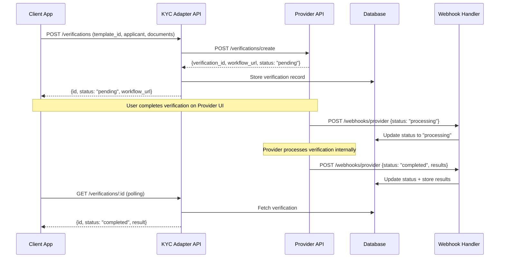

# External KYC Provider Integration - Technical Documentation

> **Version:** 2.0.0  
> **Last Updated:** January 20, 2025  
> **Status:** Planning Phase  
> **Integration Approach:** Webhook-Driven + Event-Based Architecture  
> **Reference Implementation:** IDmeta API ([Documentation](https://documenter.getpostman.com/view/46929893/2sB34mhJBq))

---

## Table of Contents

1. [Executive Summary](#executive-summary)
2. [Provider API Overview](#provider-api-overview)
3. [Architecture Design](#architecture-design)
4. [API Specification](#api-specification)
5. [Database Schema](#database-schema)
6. [Provider Implementation](#provider-implementation)
7. [Webhook Integration](#webhook-integration)
8. [Integration Patterns](#integration-patterns)
9. [Security & Compliance](#security--compliance)
10. [Testing Strategy](#testing-strategy)
11. [Deployment Checklist](#deployment-checklist)

---

## Executive Summary

### Purpose
Integrate an external verification provider into the KYC Adapter while maintaining a generic architecture that supports multiple providers (current and future) without vendor lock-in.

### Integration Approach: Webhook-Driven Architecture

**Key Model:**
```
Client → POST /verifications → Provider API (create verification) →
Provider processes internally → Sends webhooks on status changes →
Our webhook handler updates DB → Client polls for status
```

**Why Webhook-Driven:**
- ✅ Aligns with modern provider API designs
- ✅ Simpler than multi-step orchestration
- ✅ Provider handles all workflow complexity internally
- ✅ Real-time updates via webhooks
- ✅ Natural event-driven architecture

### Key Differentiators

| Feature | Traditional KYC (Regula) | External Provider |
|---------|--------------------------|-------------------|
| **API Base URL** | Custom SDK/API | `https://provider-api.com/api/v1/` |
| **Authentication** | Various | `X-API-Key` header |
| **Verification Model** | Single request/response | Request + Webhook callbacks |
| **Workflow** | Direct processing | Template-based, provider-hosted |
| **Session Management** | Stateless | `verification_id` tracking |
| **ID-Based Verification** | ❌ Not supported | ✅ Government database checks |
| **Hosted UI** | ❌ No | ✅ White-labeled verification flows |

---

## Provider API Overview

### API Basics

**Base URL:** `https://provider-api.com/api/v1/`  
**Authentication:** `X-API-Key: your_api_key_here`  
**Content-Type:** `application/json`

### Core Concepts

#### 1. Templates

Templates are **pre-configured verification workflows** created in the provider's dashboard.

**Template Structure:**
```json
{
  "id": "tmpl_abc123xyz",
  "name": "Basic KYC Workflow",
  "description": "Document + Biometric verification",
  "steps": [
    {
      "type": "document_verification",
      "required": true,
      "config": {
        "document_types": ["national_id", "passport", "drivers_license"]
      }
    },
    {
      "type": "face_match",
      "required": true,
      "config": {
        "liveness_check": true
      }
    }
  ],
  "webhook_url": "https://your-app.com/webhooks/provider",
  "created_at": "2024-01-01T00:00:00Z"
}
```

**Common Template Types:**
- **Basic KYC**: Document + Face match
- **Enhanced KYC**: Document + Face + Liveness + AML
- **Government DB**: Registry verification (NBI/LTO/PRC/SSS for Philippine providers)
- **National ID**: QR code verification

#### 2. Verification Flow

**Two Workflow Options:**

**Option A: Hosted Workflow (Recommended)**
```
1. Create verification via API
2. Provider returns workflow_url
3. Redirect user to workflow_url
4. User completes verification on provider's interface
5. Provider sends webhook on completion
6. Client polls status endpoint for updates
```

**Option B: API-Only Workflow**
```
1. Create verification via API with documents
2. Provider processes asynchronously
3. Provider sends webhook on status changes
4. Client polls status endpoint
```

#### 3. Verification Statuses

| Status | Description | Next Action |
|--------|-------------|-------------|
| `pending` | Verification created, awaiting data | User must complete workflow |
| `processing` | Provider is analyzing submission | Wait for webhook/poll status |
| `completed` | Verification finished successfully | Retrieve results |
| `failed` | Verification failed checks | Review failure reasons |
| `expired` | Verification expired (24h default) | Create new verification |
| `cancelled` | Verification cancelled by user/admin | N/A |

#### 4. Document Types

**Supported Documents (Example):**
- `national_id` - National ID
- `passport` - Passport
- `drivers_license` - Driver's License
- `professional_license` - Professional License
- `government_id` - Government-issued ID
- `postal_id` - Postal ID
- `company_id` - Company-issued ID

#### 5. Government Database Verifications

**Direct Registry Checks (No Document Upload Required):**

| Registry Type | Provider Code | Required Data |
|---------------|---------------|---------------|
| **Clearance Check** | `clearance_check` | Full name, DOB, Control number |
| **License Verification** | `license_verification` | License number, Full name, DOB |
| **Professional License** | `professional_license` | License number, Full name, DOB |
| **Social Security** | `social_security` | SS number, Full name, DOB |
| **Registry Check** | `registry_check` | Full name, DOB, Address |

---

## Architecture Design

### High-Level Architecture

```
┌─────────────────────────────────────────────────────────┐
│                    Client Application                    │
│         (Web/Mobile - Initiates Verification)           │
└────────────────────┬────────────────────────────────────┘
                     │
                     │ POST /api/v1/verifications
                     │
                     ▼
┌─────────────────────────────────────────────────────────┐
│                  KYC Adapter API                        │
│              (verifications.controller.ts)              │
└────────────────────┬────────────────────────────────────┘
                     │
                     ▼
┌─────────────────────────────────────────────────────────┐
│              Verification Service Layer                  │
│        (Business logic - verifications.service.ts)      │
└────────────────────┬────────────────────────────────────┘
                     │
                     ▼
┌─────────────────────────────────────────────────────────┐
│              Provider Factory & Router                   │
│         (providers.factory.ts - multi-provider)         │
└────────────────────┬────────────────────────────────────┘
                     │
         ┌───────────┴───────────┐
         │                       │
         ▼                       ▼
┌──────────────────┐    ┌──────────────────┐
│  Regula Provider │    │ External Provider│
│  (Single-step)   │    │  (Webhook-based) │
└──────────────────┘    └────────┬─────────┘
                                 │
                                 │ POST /verifications/create
                                 │
                                 ▼
                        ┌────────────────────┐
                        │   Provider API     │
                        │ (External Service) │
                        └────────┬───────────┘
                                 │
                                 │ Webhooks
                                 │
                                 ▼
                        ┌────────────────────┐
                        │ Webhook Handler    │
                        │ (Update Status)    │
                        └────────────────────┘
```

### Webhook-Driven Flow



### Data Flow

**1. Verification Creation**
```typescript
// Client Request
POST /api/v1/verifications
{
  "verificationType": "document",
  "metadata": {
    "template_id": "tmpl_basic_kyc"
  },
  "applicant": {
    "firstName": "John",
    "lastName": "Doe",
    "email": "john@example.com",
    "phone": "+1234567890"
  },
  "documentImages": {
    "front": "base64...",
    "back": "base64..."
  }
}

// Provider Request (transformed by adapter)
POST https://provider-api.com/api/v1/verifications/create
X-API-Key: api_key_here
{
  "template_id": "tmpl_basic_kyc",
  "applicant": {
    "first_name": "John",
    "last_name": "Doe",
    "email": "john@example.com",
    "phone": "+1234567890"
  },
  "documents": [
    {
      "type": "national_id",
      "front_image": "base64...",
      "back_image": "base64..."
    }
  ],
  "webhook_url": "https://kyc-adapter.com/webhooks/provider",
  "redirect_url": "https://client-app.com/verification/complete"
}

// Provider Response
{
  "verification_id": "ver_abc123xyz",
  "status": "pending",
  "workflow_url": "https://verify.provider.com/v/ver_abc123xyz",
  "expires_at": "2025-01-21T10:00:00Z",
  "created_at": "2025-01-20T10:00:00Z"
}

// KYC Adapter Response
{
  "id": "uuid-internal",
  "providerVerificationId": "ver_abc123xyz",
  "status": "pending",
  "processingMethod": "EXTERNAL_LINK",
  "metadata": {
    "workflow_url": "https://verify.provider.com/v/ver_abc123xyz",
    "expires_at": "2025-01-21T10:00:00Z"
  }
}
```

**2. Webhook Updates**
```typescript
// Provider Webhook Payload
POST https://kyc-adapter.com/webhooks/provider
X-Provider-Signature: sha256=abc123...
Content-Type: application/json

{
  "event": "verification.completed",
  "verification_id": "ver_abc123xyz",
  "status": "approved",
  "timestamp": "2025-01-20T10:05:30Z",
  "data": {
    "overall_status": "approved",
    "confidence_score": 95,
    "document": {
      "type": "national_id",
      "document_number": "1234-5678-9012",
      "extracted_data": {
        "first_name": "JOHN",
        "last_name": "DOE",
        "date_of_birth": "1990-01-01",
        "address": "123 Main St"
      },
      "authenticity_checks": {
        "hologram": "passed",
        "security_features": "passed",
        "document_tampering": "passed"
      }
    },
    "biometric": {
      "face_match": {
        "status": "passed",
        "confidence": 98,
        "liveness_check": "passed"
      }
    }
  }
}
```

---

## API Specification

### Provider API Endpoints

#### 1. Create Verification

```http
POST https://provider-api.com/api/v1/verifications/create
X-API-Key: your_api_key_here
Content-Type: application/json

{
  "template_id": "tmpl_abc123",
  "applicant": {
    "first_name": "John",
    "last_name": "Doe",
    "middle_name": "Michael",
    "email": "john@example.com",
    "phone": "+1234567890",
    "date_of_birth": "1990-01-01",
    "address": {
      "street": "123 Main St",
      "city": "New York",
      "state": "NY",
      "postal_code": "10001",
      "country": "US"
    }
  },
  "documents": [
    {
      "type": "national_id",
      "front_image": "base64_encoded_string",
      "back_image": "base64_encoded_string"
    }
  ],
  "webhook_url": "https://your-app.com/webhooks/provider",
  "redirect_url": "https://your-app.com/verification/complete",
  "metadata": {
    "user_id": "user_123",
    "session_id": "sess_456",
    "custom_field": "custom_value"
  }
}
```

**Response (201 Created):**
```json
{
  "verification_id": "ver_abc123xyz",
  "status": "pending",
  "workflow_url": "https://verify.provider.com/v/ver_abc123xyz",
  "expires_at": "2025-01-21T10:00:00Z",
  "created_at": "2025-01-20T10:00:00Z"
}
```

#### 2. Get Verification Status

```http
GET https://provider-api.com/api/v1/verifications/{verification_id}
X-API-Key: your_api_key_here
```

**Response (200 OK):**
```json
{
  "verification_id": "ver_abc123xyz",
  "status": "completed",
  "template_id": "tmpl_abc123",
  "applicant": {
    "first_name": "John",
    "last_name": "Doe"
  },
  "result": {
    "overall_status": "approved",
    "confidence_score": 95,
    "risk_level": "low",
    "checks_performed": ["document", "face_match", "liveness"],
    "document": { ... },
    "biometric": { ... }
  },
  "created_at": "2025-01-20T10:00:00Z",
  "completed_at": "2025-01-20T10:05:30Z"
}
```

#### 3. Get Templates

```http
GET https://provider-api.com/api/v1/templates
X-API-Key: your_api_key_here
```

**Response (200 OK):**
```json
{
  "templates": [
    {
      "id": "tmpl_basic_kyc",
      "name": "Basic KYC",
      "description": "Document + Face verification",
      "steps": [
        {
          "type": "document_verification",
          "required": true
        },
        {
          "type": "face_match",
          "required": true
        }
      ]
    }
  ],
  "total": 5,
  "page": 1,
  "per_page": 20
}
```

#### 4. Government Database Verification

```http
POST https://provider-api.com/api/v1/verifications/gov-registry
X-API-Key: your_api_key_here

{
  "registry_type": "clearance_check",
  "data": {
    "control_number": "REG-123456789",
    "first_name": "John",
    "last_name": "Doe",
    "date_of_birth": "1990-01-01"
  },
  "webhook_url": "https://your-app.com/webhooks/provider"
}
```

**Response (201 Created):**
```json
{
  "verification_id": "ver_gov_abc123",
  "status": "processing",
  "registry_type": "clearance_check",
  "estimated_completion": "2-5 minutes"
}
```

### Our KYC Adapter API (No Changes!)

**Existing endpoints remain unchanged:**

```http
POST /api/v1/verifications
GET /api/v1/verifications/:id
PATCH /api/v1/verifications/:id/cancel
```

**The adapter internally:**
1. Detects tenant is using external provider
2. Transforms request to provider format
3. Calls provider API
4. Returns unified response
5. Handles webhooks in background

---

## Database Schema

### Existing Tables (Minimal Changes)

#### Update `verifications` Table

```sql
-- Add columns for provider-specific data
ALTER TABLE verifications
ADD COLUMN IF NOT EXISTS external_verification_id VARCHAR(255) UNIQUE,
ADD COLUMN IF NOT EXISTS external_workflow_url TEXT,
ADD COLUMN IF NOT EXISTS external_template_id VARCHAR(255),
ADD COLUMN IF NOT EXISTS webhook_received_at TIMESTAMP,
ADD COLUMN IF NOT EXISTS last_webhook_event VARCHAR(100);

CREATE INDEX idx_verifications_external_id ON verifications(external_verification_id);
CREATE INDEX idx_verifications_webhook ON verifications(webhook_received_at);

COMMENT ON COLUMN verifications.external_verification_id IS 'External provider verification ID for status polling';
COMMENT ON COLUMN verifications.external_workflow_url IS 'URL for user to complete verification on provider UI';
COMMENT ON COLUMN verifications.external_template_id IS 'Template used for this verification';
COMMENT ON COLUMN verifications.webhook_received_at IS 'Last webhook received timestamp';
```

#### Update `providers` Table

```sql
-- Add provider capabilities
ALTER TABLE providers
ADD COLUMN IF NOT EXISTS supports_webhooks BOOLEAN DEFAULT false,
ADD COLUMN IF NOT EXISTS supports_hosted_workflow BOOLEAN DEFAULT false,
ADD COLUMN IF NOT EXISTS webhook_secret VARCHAR(255);

COMMENT ON COLUMN providers.supports_webhooks IS 'Provider sends webhook notifications';
COMMENT ON COLUMN providers.supports_hosted_workflow IS 'Provider offers hosted verification UI';
COMMENT ON COLUMN providers.webhook_secret IS 'Secret for webhook signature verification';
```

### New Tables (Optional - For Template Caching)

#### `provider_templates` - Cache Templates

```sql
CREATE TABLE IF NOT EXISTS provider_templates (
    id SERIAL PRIMARY KEY,
    
    -- Provider reference
    provider_id INTEGER NOT NULL REFERENCES providers(id) ON DELETE CASCADE,
    
    -- Template identifiers
    external_template_id VARCHAR(255) NOT NULL,
    name VARCHAR(255) NOT NULL,
    description TEXT,
    
    -- Template configuration
    steps JSONB NOT NULL DEFAULT '[]',
    
    -- Status
    is_active BOOLEAN DEFAULT true,
    
    -- Timestamps
    created_at TIMESTAMP DEFAULT CURRENT_TIMESTAMP,
    updated_at TIMESTAMP DEFAULT CURRENT_TIMESTAMP,
    synced_at TIMESTAMP DEFAULT CURRENT_TIMESTAMP,
    
    -- Constraints
    CONSTRAINT unique_provider_template UNIQUE (provider_id, external_template_id)
);

CREATE INDEX idx_provider_templates_provider ON provider_templates(provider_id);
CREATE INDEX idx_provider_templates_active ON provider_templates(is_active);
CREATE INDEX idx_provider_templates_synced ON provider_templates(synced_at);

COMMENT ON TABLE provider_templates IS 'Cached templates from external providers for faster lookups';
```

#### `webhook_logs` - Audit Trail

```sql
CREATE TABLE IF NOT EXISTS webhook_logs (
    id SERIAL PRIMARY KEY,
    
    -- Webhook details
    provider VARCHAR(50) NOT NULL,
    event_type VARCHAR(100) NOT NULL,
    verification_id UUID REFERENCES verifications(id) ON DELETE CASCADE,
    
    -- Payload
    payload JSONB NOT NULL,
    signature VARCHAR(255),
    
    -- Processing
    processed BOOLEAN DEFAULT false,
    processed_at TIMESTAMP,
    error_message TEXT,
    
    -- Timestamps
    received_at TIMESTAMP DEFAULT CURRENT_TIMESTAMP
);

CREATE INDEX idx_webhook_logs_verification ON webhook_logs(verification_id);
CREATE INDEX idx_webhook_logs_processed ON webhook_logs(processed, received_at);
CREATE INDEX idx_webhook_logs_provider ON webhook_logs(provider, event_type);

COMMENT ON TABLE webhook_logs IS 'Audit log of all webhook events received from providers';
```

---

## Provider Implementation

### Provider Structure

```
src/providers/implementations/external/
├── external.provider.ts              ← Main provider adapter
├── external-http.client.ts           ← API communication
├── external-webhook.handler.ts       ← Webhook processing
├── mappers/
│   ├── request.mapper.ts             ← Map our format → Provider
│   └── response.mapper.ts            ← Map Provider → our format
├── services/
│   └── template-cache.service.ts     ← Optional template caching
└── types/
    ├── provider-api.types.ts         ← Provider API types
    └── provider-webhook.types.ts     ← Webhook payload types
```

### Implementation: External Provider

```typescript
// src/providers/implementations/external/external.provider.ts

import { Injectable, Logger } from '@nestjs/common';
import { IKycProvider } from '../interfaces/kyc-provider.interface';
import { 
  VerificationRequest, 
  VerificationResponse,
  VerificationStatusResponse,
  ProviderHealthResponse
} from '../types/provider.types';
import { ExternalHttpClient } from './external-http.client';
import { ExternalRequestMapper } from './mappers/request.mapper';
import { ExternalResponseMapper } from './mappers/response.mapper';

@Injectable()
export class ExternalProvider implements IKycProvider {
  private readonly logger = new Logger(ExternalProvider.name);
  private apiKey: string;
  private baseUrl: string = 'https://provider-api.com/api/v1';
  private webhookSecret: string;
  private initialized = false;

  readonly name = 'External KYC Provider';
  readonly type = 'external';
  readonly processingMode = 'webhook_driven' as const;

  constructor(
    private readonly httpClient: ExternalHttpClient,
    private readonly requestMapper: ExternalRequestMapper,
    private readonly responseMapper: ExternalResponseMapper,
  ) {}

  /**
   * Initialize provider with credentials
   */
  async initialize(credentials: any, config?: any): Promise<void> {
    this.logger.log('Initializing external provider...');
    
    if (!credentials.apiKey) {
      throw new Error('Provider API key is required');
    }

    this.apiKey = credentials.apiKey;
    this.webhookSecret = credentials.webhookSecret || '';
    this.baseUrl = credentials.baseUrl || this.baseUrl;
    
    this.httpClient.configure({
      apiKey: this.apiKey,
      baseUrl: this.baseUrl,
    });

    this.initialized = true;
    this.logger.log('External provider initialized successfully');
  }

  /**
   * Create verification
   */
  async createVerification(request: VerificationRequest): Promise<VerificationResponse> {
    this.ensureInitialized();

    try {
      // Transform request to provider format
      const providerRequest = this.requestMapper.toProviderCreateRequest(request);
      
      // Call provider API
      const providerResponse = await this.httpClient.createVerification(providerRequest);
      
      // Transform response to our unified format
      const response = this.responseMapper.toVerificationResponse(providerResponse);
      
      this.logger.log(`Verification created: ${providerResponse.verification_id}`);
      return response;
      
    } catch (error) {
      this.logger.error(`Failed to create verification: ${error.message}`, error.stack);
      throw new Error(`Provider verification failed: ${error.message}`);
    }
  }

  /**
   * Get verification status
   */
  async getVerificationStatus(providerVerificationId: string): Promise<VerificationStatusResponse> {
    this.ensureInitialized();

    try {
      const providerStatus = await this.httpClient.getVerificationStatus(providerVerificationId);
      return this.responseMapper.toStatusResponse(providerStatus);
    } catch (error) {
      this.logger.error(`Failed to get status: ${error.message}`);
      throw error;
    }
  }

  /**
   * Cancel verification
   */
  async cancelVerification(providerVerificationId: string): Promise<boolean> {
    this.ensureInitialized();

    try {
      await this.httpClient.cancelVerification(providerVerificationId);
      return true;
    } catch (error) {
      this.logger.error(`Failed to cancel: ${error.message}`);
      return false;
    }
  }

  /**
   * Handle webhook from provider
   */
  async handleWebhook(payload: any, signature?: string): Promise<VerificationStatusResponse | null> {
    try {
      // Validate webhook signature
      if (signature && this.webhookSecret) {
        const isValid = this.validateWebhookSignature(payload, signature);
        if (!isValid) {
          this.logger.warn('Invalid webhook signature');
          return null;
        }
      }

      // Transform webhook payload to our format
      return this.responseMapper.fromWebhookToStatus(payload);
      
    } catch (error) {
      this.logger.error(`Webhook handling failed: ${error.message}`);
      return null;
    }
  }

  /**
   * Health check
   */
  async healthCheck(): Promise<ProviderHealthResponse> {
    try {
      const start = Date.now();
      const templates = await this.httpClient.getTemplates();
      const latency = Date.now() - start;
      
      return {
        isHealthy: templates && templates.length >= 0,
        latency,
        lastChecked: new Date(),
      };
    } catch (error) {
      return {
        isHealthy: false,
        error: error.message,
        lastChecked: new Date(),
      };
    }
  }

  /**
   * Validate credentials
   */
  async validateCredentials(): Promise<boolean> {
    try {
      const health = await this.healthCheck();
      return health.isHealthy;
    } catch {
      return false;
    }
  }

  // Private helper methods

  private ensureInitialized(): void {
    if (!this.initialized) {
      throw new Error('Provider not initialized. Call initialize() first.');
    }
  }

  private validateWebhookSignature(payload: any, signature: string): boolean {
    const crypto = require('crypto');
    const hmac = crypto.createHmac('sha256', this.webhookSecret);
    const expectedSignature = 'sha256=' + hmac.update(JSON.stringify(payload)).digest('hex');
    return crypto.timingSafeEqual(
      Buffer.from(signature),
      Buffer.from(expectedSignature)
    );
  }
}
```

---

## Webhook Integration

### Webhook Handler

```typescript
// src/webhooks/provider-webhook.controller.ts

import { Controller, Post, Body, Headers, Logger, HttpCode } from '@nestjs/common';
import { ProviderWebhookService } from './provider-webhook.service';

@Controller('webhooks/provider')
export class ProviderWebhookController {
  private readonly logger = new Logger(ProviderWebhookController.name);

  constructor(
    private readonly webhookService: ProviderWebhookService,
  ) {}

  @Post()
  @HttpCode(200)
  async handleWebhook(
    @Body() payload: any,
    @Headers('x-provider-signature') signature: string,
  ): Promise<{ received: boolean }> {
    this.logger.log(`Webhook received: ${payload.event}`);

    try {
      await this.webhookService.processWebhook(payload, signature);
      return { received: true };
    } catch (error) {
      this.logger.error(`Webhook processing failed: ${error.message}`);
      // Return 200 anyway to prevent provider retries
      return { received: false };
    }
  }
}
```

### Webhook Service

```typescript
// src/webhooks/provider-webhook.service.ts

import { Injectable, Logger } from '@nestjs/common';
import { InjectRepository } from '@nestjs/typeorm';
import { Repository } from 'typeorm';
import { Verification } from '../database/entities/verification.entity';
import { WebhookLog } from '../database/entities/webhook-log.entity';

@Injectable()
export class ProviderWebhookService {
  private readonly logger = new Logger(ProviderWebhookService.name);

  constructor(
    @InjectRepository(Verification)
    private readonly verificationRepo: Repository<Verification>,
    @InjectRepository(WebhookLog)
    private readonly webhookLogRepo: Repository<WebhookLog>,
  ) {}

  async processWebhook(payload: any, signature: string): Promise<void> {
    // Log webhook for audit
    const log = await this.logWebhook(payload, signature);

    try {
      const { verification_id, event, status, data } = payload;

      // Find verification by external verification ID
      const verification = await this.verificationRepo.findOne({
        where: { externalVerificationId: verification_id },
      });

      if (!verification) {
        this.logger.warn(`Verification not found for external ID: ${verification_id}`);
        return;
      }

      // Update verification based on event type
      switch (event) {
        case 'verification.processing':
          verification.status = 'in_progress';
          break;

        case 'verification.completed':
          verification.status = status === 'approved' ? 'completed' : 'failed';
          verification.result = data;
          verification.completedAt = new Date();
          break;

        case 'verification.failed':
          verification.status = 'failed';
          verification.errorDetails = data.error || {};
          verification.failedAt = new Date();
          break;

        case 'verification.expired':
          verification.status = 'expired';
          verification.expiresAt = new Date();
          break;

        default:
          this.logger.warn(`Unknown webhook event: ${event}`);
      }

      verification.webhookReceivedAt = new Date();
      verification.lastWebhookEvent = event;

      await this.verificationRepo.save(verification);

      // Mark log as processed
      log.processed = true;
      log.processedAt = new Date();
      await this.webhookLogRepo.save(log);

      this.logger.log(`Webhook processed: ${event} for verification ${verification.id}`);

    } catch (error) {
      this.logger.error(`Failed to process webhook: ${error.message}`, error.stack);
      
      // Update log with error
      log.errorMessage = error.message;
      await this.webhookLogRepo.save(log);
      
      throw error;
    }
  }

  private async logWebhook(payload: any, signature: string): Promise<WebhookLog> {
    const log = this.webhookLogRepo.create({
      provider: 'external',
      eventType: payload.event,
      payload,
      signature,
      processed: false,
      receivedAt: new Date(),
    });

    return this.webhookLogRepo.save(log);
  }
}
```

---

## Security & Compliance

### API Key Management

```typescript
// Store provider credentials securely
{
  "provider": "external",
  "credentials": {
    "apiKey": "encrypted_api_key_here",  // Encrypted at rest
    "webhookSecret": "encrypted_secret_here",
    "baseUrl": "https://provider-api.com/api/v1"
  }
}
```

### Webhook Security

**1. Signature Verification:**
```typescript
// Provider sends signature in header
X-Provider-Signature: sha256=abc123...

// Verify signature
const crypto = require('crypto');
const hmac = crypto.createHmac('sha256', webhookSecret);
const expectedSignature = 'sha256=' + hmac.update(requestBody).digest('hex');

if (receivedSignature !== expectedSignature) {
  throw new Error('Invalid signature');
}
```

**2. Idempotency:**
```typescript
// Store webhook event IDs to prevent duplicate processing
const eventId = payload.event_id;
const exists = await webhookLogRepo.findOne({ where: { eventId } });

if (exists) {
  return { received: true }; // Already processed
}
```

---

## Testing Strategy

### Unit Tests

```typescript
describe('ExternalProvider', () => {
  it('should create verification with correct format', async () => {
    const mockResponse = {
      verification_id: 'ver_test123',
      status: 'pending',
      workflow_url: 'https://verify.provider.com/v/ver_test123'
    };
    
    httpClient.createVerification.mockResolvedValue(mockResponse);
    
    const result = await provider.createVerification(mockRequest);
    
    expect(result.providerVerificationId).toBe('ver_test123');
    expect(result.status).toBe('pending');
  });

  it('should handle webhooks correctly', async () => {
    const payload = {
      event: 'verification.completed',
      verification_id: 'ver_test123',
      status: 'approved'
    };
    
    const result = await provider.handleWebhook(payload, validSignature);
    
    expect(result.status).toBe('completed');
  });
});
```

---

## Deployment Checklist

### Pre-Deployment

- [ ] Provider API credentials obtained
- [ ] Test account verified
- [ ] Database migrations tested
- [ ] Webhook endpoint secured
- [ ] All tests passing
- [ ] Documentation updated

### Deployment Steps

1. **Database Migration:**
```bash
npm run migration:run
```

2. **Configure Provider:**
```sql
INSERT INTO providers (name, type, is_active, supports_webhooks, supports_hosted_workflow, credentials)
VALUES (
  'External KYC Provider',
  'external',
  true,
  true,
  true,
  jsonb_build_object(
    'apiKey', 'encrypted_api_key',
    'webhookSecret', 'encrypted_webhook_secret',
    'baseUrl', 'https://provider-api.com/api/v1'
  )
);
```

3. **Configure Webhook URL in Provider Dashboard:**
```
Webhook URL: https://kyc-adapter.com/webhooks/provider
Events: verification.*, all
Secret: [webhook_secret]
```

### Post-Deployment

- [ ] Monitor webhook delivery
- [ ] Check verification completion rates
- [ ] Verify workflow URLs accessible
- [ ] Monitor API quota usage
- [ ] Review webhook logs

---

## Appendix

### Environment Variables

```bash
# Provider Configuration
EXTERNAL_PROVIDER_API_KEY=your_api_key_here
EXTERNAL_PROVIDER_API_URL=https://provider-api.com/api/v1
EXTERNAL_PROVIDER_WEBHOOK_SECRET=your_webhook_secret_here

# Webhook Configuration
WEBHOOK_BASE_URL=https://kyc-adapter.com
WEBHOOK_SIGNATURE_VERIFICATION=true
```

---

**Document End**

*This documentation provides a generic, provider-agnostic integration guide. Adapt endpoint URLs, field names, and authentication methods based on your specific provider's API documentation.*

