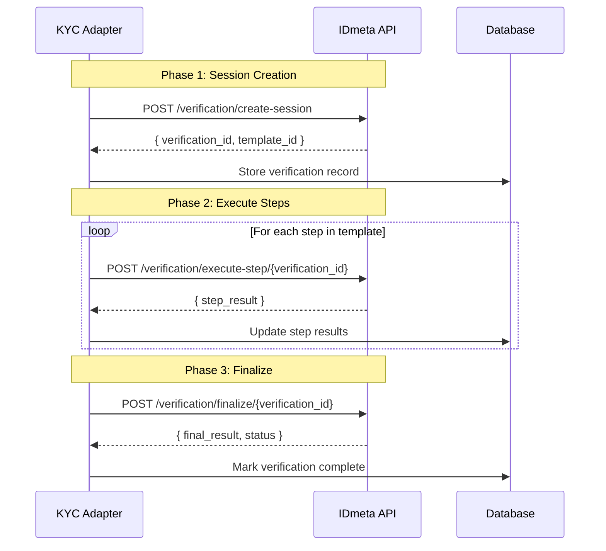
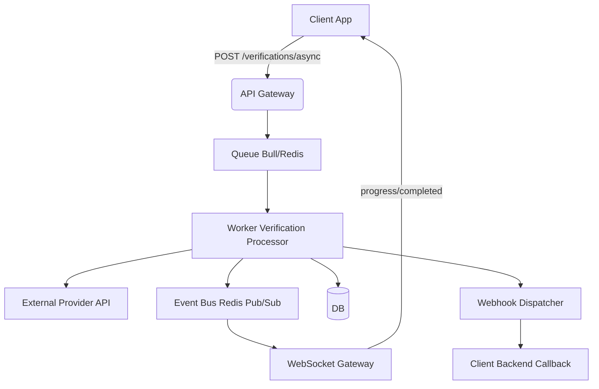
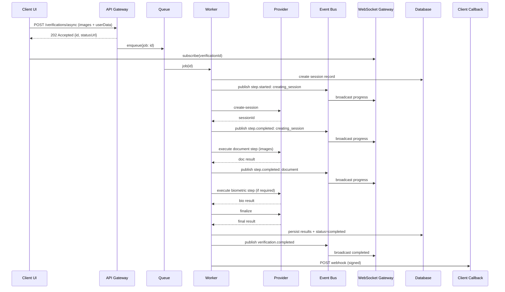
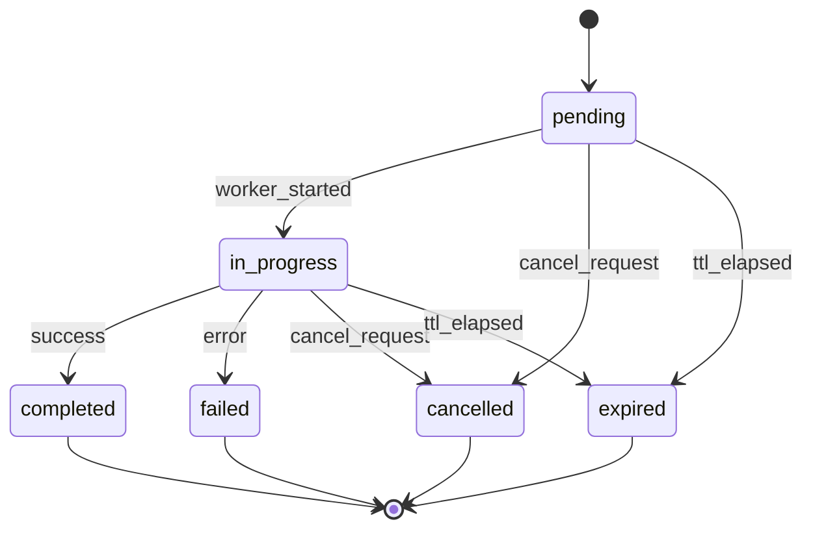
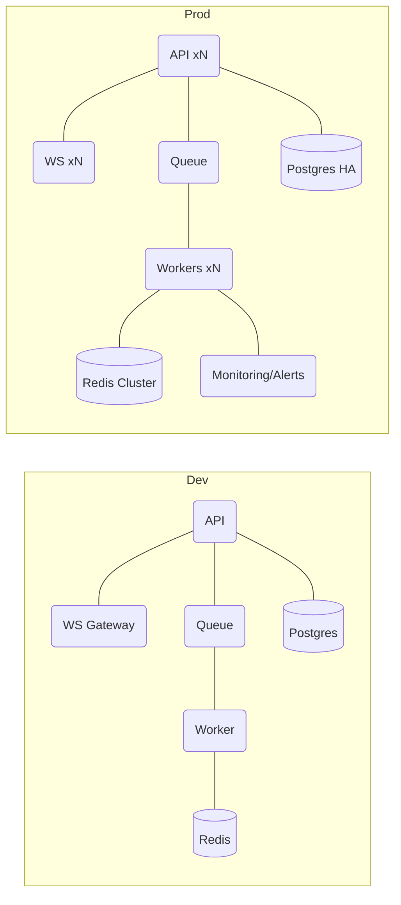
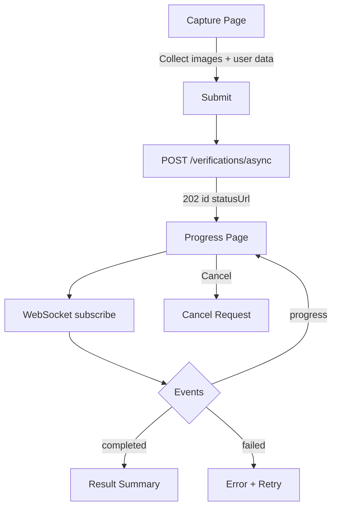
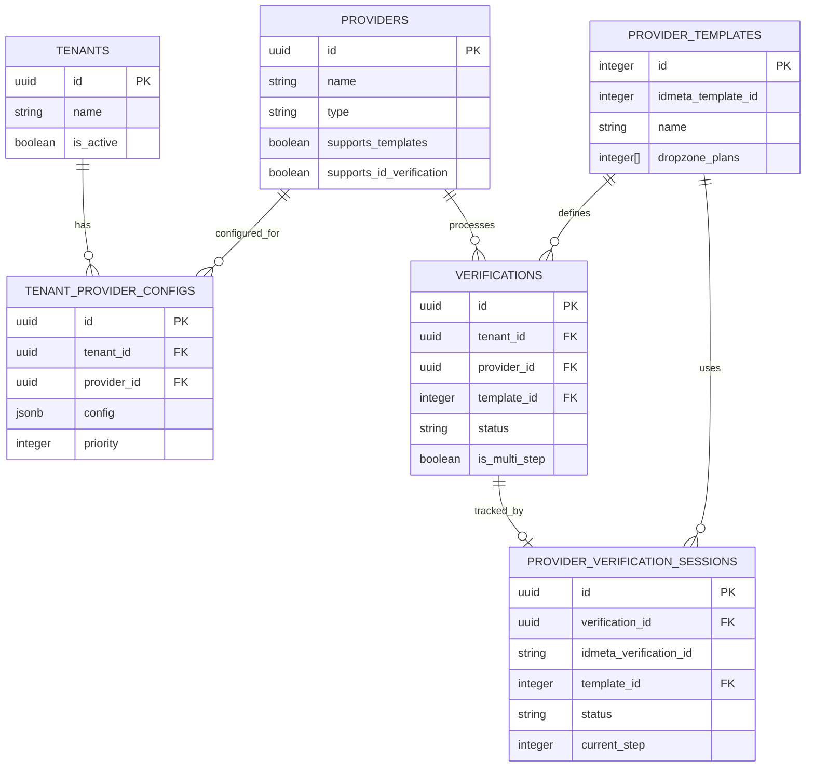

# Verification Provider Integration - Technical Documentation

> **Version:** 1.0.0  
> **Last Updated:** October 16, 2025  
> **Status:** Planning Phase  
> **Integration Approach:** Template-First + Event-Driven (Async + WebSockets)

---

## Table of Contents

1. [Executive Summary](#executive-summary)
2. [Provider Overview](#provider-overview)
3. [Architecture Design](#architecture-design)
11. [Event-Driven Architecture Deep Dive](#event-driven-architecture-deep-dive)
12. [UI/UX Integration Flow](#uiux-integration-flow)
13. [Data Contracts (Events and Webhooks)](#data-contracts-events-and-webhooks)
14. [Operational Runbook](#operational-runbook)
4. [API Specification](#api-specification)
5. [Database Schema](#database-schema)
6. [Provider Implementation](#provider-implementation)
7. [Integration Patterns](#integration-patterns)
8. [Security & Compliance](#security--compliance)
9. [Testing Strategy](#testing-strategy)
10. [Deployment Checklist](#deployment-checklist)

---

## Executive Summary

### Purpose
Integrate a primary external verification provider into the KYC Adapter while maintaining a generic architecture that supports multiple providers (current and future) without vendor lock-in.

### Integration Approach: Template-First + Event-Driven
- **Phase 1:** Implement template-based verification using provider-defined templates
- **Phase 2:** Event-driven processing (async jobs + WebSocket updates)
- **Why:** Better UX, scalable, resilient; keeps client API unchanged
- **Future:** Upgradable to hybrid (template + custom) without breaking changes

### Key Differentiators of the External Provider

| Feature | Traditional KYC (Regula) | IDmeta |
|---------|--------------------------|--------|
| **Verification Method** | Document OCR only | OCR + Direct Database Lookups |
| **Localized Support** | Generic document scanning | Direct checks for country-specific registries (e.g., licenses, police, social security) |
| **Workflow** | Single API call | Multi-step session-based workflow |
| **Session Management** | Stateless | Template-based sessions with `verification_id` |
| **ID-Based Verification** | ❌ Not supported | ✅ Direct database checks (no document upload) |
| **Processing Model** | Synchronous | Multi-step with finalization |

---

## Provider Overview

### What is IDmeta?

The external provider offers a comprehensive identity verification platform that goes beyond traditional document OCR by providing:

1. **Document Verification** - OCR and document authenticity checks
2. **Biometric Verification** - Face matching, liveness detection
3. **Government Database Verification** - Direct lookups in Philippine government systems
4. **AML Screening** - Anti-Money Laundering watchlist checks
5. **PhilSys Integration** - Philippine National ID QR code verification

### Core Concepts

#### 1. Templates
Templates are **pre-configured verification workflows** that define:
- Which verification steps to execute
- The order of execution
- Which plans (verification types) are included

**Templates Example:**
```json
{
  "id": 456,
  "name": "Untitled 21/03/2025",
  "workflow_id": "I1QZl8LgU8P5Zs4lZXqbgBIK",
  "dropzone_plans": [166, 162, 163] // Document + Biometrics + Face Compare
}
```

#### 2. Plans (Verification Types)
Each plan represents a specific type of verification:

| Plan ID | Code | Description | Category |
|---------|------|-------------|----------|
| 166 | `document_verification` | Document OCR & validation | Document |
| 162 | `biometrics_verification` | Biometric verification | Biometric |
| 163 | `biometrics_face_compare` | Face matching | Biometric |
| 164 | `scan_qr` | PhilSys QR scanning | PH ID System |
| 165 | `aml` | AML watchlist screening | Compliance |
| 167 | `philippines_driving_license` | LTO license verification | PH Gov DB |
| 168 | `philippines_prc` | PRC license verification | PH Gov DB |
| 169 | `philippines_national_police` | Police clearance check | PH Gov DB |
| 170 | `philippines_nbi_clearance` | NBI clearance check | PH Gov DB |
| 171 | `philippines_social_security` | SSS verification | PH Gov DB |
| 161 | `custom_document` | Custom document types | Document |

#### 3. Verification Workflow

IDmeta uses a **3-phase workflow**:



### ID-Based Verification: The Game Changer

**Traditional KYC:**
```
User uploads document photo → OCR extracts data → Verify document authenticity
```

**IDmeta ID-Based:**
```
User provides ID number → IDmeta queries government database → Get official status
```

**Example: NBI Clearance Verification**
```json
{
  "verification_type": "philippines_nbi_clearance",
  "id_number": "NBI-123456789",
  "birthdate": "1990-01-01",
  "full_name": "Juan Dela Cruz"
}
```

**Response:**
```json
{
  "status": "verified",
  "clearance_status": "clear",
  "issue_date": "2024-10-15",
  "expiry_date": "2025-10-15",
  "purpose": "Employment",
  "verification_method": "government_database"
}
```

---

## Architecture Design

### Event-Driven Processing Layer (NEW)

To support real-time UX and scalability, we add an event-driven processing layer:

```
Client → POST /verifications (202) → Job Queue → Worker executes steps →
Event Bus publishes progress → WebSocket gateway pushes updates →
Webhook dispatcher notifies external systems on completion
```

Components:
- Queue (Bull/Redis): buffers verification jobs
- Worker: runs provider steps, publishes step events
- Event Bus (Redis Pub/Sub): decouples producers/consumers
- WebSocket Gateway: streams progress to subscribed clients
- Webhook Dispatcher: signs and posts final events to client callback URLs

### Getting Started (Event-Driven) — Do This First

1. Environment & packages
   - Provision Redis locally (e.g., docker-compose `redis:7-alpine`, port 6379, `appendonly yes`).
   - Install packages:
     - `npm i @nestjs/bull bull ioredis @nestjs/websockets @nestjs/platform-socket.io socket.io`
     - `npm i -D @types/socket.io`
   - Add env vars:
     - `REDIS_HOST`, `REDIS_PORT`, `REDIS_PASSWORD` (optional)
     - `WEBSOCKET_CORS_ORIGIN` (comma-separated allowlist)
2. Database migrations
   - Create `provider_verification_sessions` with fields for `external_verification_id`, `status`, `current_step`, `total_steps`, `completed_steps`, `step_results`.
   - Extend `verifications` with `template_id`, `processing_steps`, `verification_method`, `is_multi_step`.
3. Queue module
   - Create `QueueModule`; configure `BullModule.forRoot` and `BullModule.registerQueue({ name: 'verifications' })`.
4. Event bus (Pub/Sub)
   - Create `EventBusService` using an ioredis subscriber; publish/subscribe `verification.*` events.
5. Worker processor
   - Implement `VerificationsProcessor` to execute multi-step flow and emit `created/started/step.completed/completed/failed`.
6. Persist progress
   - Update `provider_verification_sessions` on each step; expose snapshot via status endpoint.
7. WebSocket gateway
   - Namespace `/verifications`; `subscribe`/`unsubscribe` handlers; broadcast `progress/completed/failed`.
8. Async API endpoints
   - `POST /verifications/async` → return 202 with `{ id, statusUrl }`.
   - `GET /verifications/:id` → return current status + progress; keep legacy sync POST for compatibility.
9. Webhook dispatcher
   - Sign payloads with HMAC SHA-256; retries with exponential backoff; log dead-letter cases.
10. Observability & resilience
   - Structured logs (tenant, provider, verificationId); metrics (queue depth, durations, success/fail); timeouts/retries/idempotency.
11. Security
   - Encrypt credentials; rate-limit create; WebSocket auth + CORS allowlist; sanitize inputs.
12. Testing
   - Unit tests for adapter, template sync, worker, gateway, dispatcher; E2E tests for async + real-time flow.

---

## Event-Driven Architecture Deep Dive

### Component Diagram



### End-to-End Sequence (Async)



### Verification State Machine



### Deployment Topology (Dev/Prod)



---

## UI/UX Integration Flow

### User Journey (Capture → Progress → Result)



UI expectations:
- Progress timeline (session, document, biometric, finalize)
- Real-time updates via WebSocket; fallback polling every 3–5s
- Actions: Cancel (if allowed), Retry on failure, Continue on success
- Result summary (overall status, confidence, key fields, risk flags)

---

## Data Contracts (Events and Webhooks)

### Event Types
- verification.created
- verification.started
- verification.step.started (payload includes step name and index)
- verification.step.completed
- verification.step.failed
- verification.completed
- verification.failed
- verification.cancelled

### Example Event Payload

```json
{
  "type": "verification.step.completed",
  "verificationId": "ver_123",
  "tenantId": "ten_456",
  "timestamp": "2025-10-16T10:05:00Z",
  "data": {
    "step": 2,
    "totalSteps": 4,
    "name": "document",
    "message": "Document verified",
    "metrics": { "durationMs": 2350 }
  },
  "metadata": { "correlationId": "req_abc" }
}
```

### Webhook Payload & Signing
- Header: `X-Webhook-Signature: <hex-hmac-sha256>` over raw body using a shared secret
- Retries: exponential backoff (e.g., 1s, 4s, 16s, 64s), max attempts configurable
- Idempotency: include `verificationId` and `eventId` to dedupe

```json
{
  "event": "verification.completed",
  "verificationId": "ver_123",
  "tenantId": "ten_456",
  "timestamp": "2025-10-16T10:06:30Z",
  "data": {
    "status": "completed",
    "result": {
      "overall": { "status": "passed", "confidence": 94, "riskLevel": "low" },
      "document": { "extracted": { "firstName": "Juan" } },
      "biometric": { "livenessCheck": "passed" }
    }
  }
}
```

---

## Operational Runbook

### Environment Variables
- REDIS_HOST, REDIS_PORT, REDIS_PASSWORD
- WEBSOCKET_CORS_ORIGIN
- PROVIDER_API_TOKEN, PROVIDER_API_URL
- WEBHOOK_SECRET

### Scaling & Resilience
- Scale workers horizontally; monitor queue depth and processing times
- Separate Redis for Bull and Pub/Sub in high throughput scenarios
- Use TTLs on verifications; implement cancellation paths

### Monitoring & Alerting
- Metrics: queue depth, job durations, success/failure rates, WS connection counts
- Alerts: spike in failures, stuck jobs, webhook delivery failures

Our KYC Adapter uses a **provider-agnostic architecture**:

```
┌─────────────────────────────────────────────────────────┐
│                    Client API Layer                      │
│  (Tenant API endpoints - verifications.controller.ts)   │
└────────────────────┬────────────────────────────────────┘
                     │
                     ▼
┌─────────────────────────────────────────────────────────┐
│              Verification Service Layer                  │
│        (Business logic - verifications.service.ts)       │
└────────────────────┬────────────────────────────────────┘
                     │
                     ▼
┌─────────────────────────────────────────────────────────┐
│              Provider Factory & Router                   │
│         (providers.factory.ts - multi-provider)          │
└────────────────────┬────────────────────────────────────┘
                     │
         ┌───────────┴───────────┐
         │                       │
         ▼                       ▼
┌──────────────────┐    ┌──────────────────┐
│  Provider A      │    │  Provider B      │
│  (Single-step)   │    │  (Multi-step)    │
└──────────────────┘    └──────────────────┘
```

### Adapter Pattern for Multi-Step Providers

**Problem:** Some providers have a multi-step workflow, but our existing API is single-step.

**Solution (Sync Path - Legacy Compatible):** The provider adapter internally manages the multi-step workflow:

```typescript
// Client makes ONE call
POST /api/v1/verifications
{
  "template_id": 426,
  "user_data": { ... }
}

// Provider adapter internally does:
// 1. Create session
// 2. Execute all template steps
// 3. Finalize session
// 4. Return unified result

// Client gets ONE response (same as Regula)
{
  "id": "verification-uuid",
  "status": "completed",
  "result": { ... }
}
```

### Multi-Tenant Provider Configuration

Each tenant can have different provider configurations:

```sql
-- Tenant A uses Regula
tenant_provider_configs:
  tenant_id: tenant-A
  provider_id: regula-provider-id
  is_enabled: true
  priority: 1

-- Tenant B uses IDmeta with Template 426
tenant_provider_configs:
  tenant_id: tenant-B
  provider_id: idmeta-provider-id
  is_enabled: true
  priority: 1
  config: { "default_template_id": 426 }
```

---

## API Specification

### External Provider API Endpoints (Examples)

#### 1. Get Templates
```http
GET https://integrate.idmetagroup.com/api/company/get-templates?page=1&per_page=10
Authorization: Bearer {api_token}
```

**Response:**
```json
{
  "templates": {
    "data": [
      {
        "id": 456,
        "name": "Untitled 21/03/2025",
        "workflow_id": "I1QZl8LgU8P5Zs4lZXqbgBIK",
        "dropzone_plans": "[166, 162, 163]"
      }
    ]
  },
  "verificationTypeOptions": [ ... ]
}
```

#### 2. Create Verification Session
```http
POST https://integrate.idmetagroup.com/api/verification/create-session
Authorization: Bearer {api_token}
Content-Type: application/json

{
  "template_id": 426,
  "user_info": {
    "first_name": "Juan",
    "last_name": "Dela Cruz",
    "date_of_birth": "1990-01-01"
  }
}
```

**Response:**
```json
{
  "verification_id": "ver_abc123xyz",
  "template_id": 426,
  "status": "pending",
  "created_at": "2025-10-16T10:00:00Z"
}
```

#### 3. Execute Verification Step
```http
POST https://integrate.idmetagroup.com/api/verification/execute-step/{verification_id}
Authorization: Bearer {api_token}
Content-Type: application/json

{
  "step_type": "document_verification",
  "step_data": {
    "document_front": "base64...",
    "document_back": "base64..."
  }
}
```

#### 4. Finalize Verification
```http
POST https://integrate.idmetagroup.com/api/verification/finalize/{verification_id}
Authorization: Bearer {api_token}
```

**Response:**
```json
{
  "verification_id": "ver_abc123xyz",
  "status": "completed",
  "result": {
    "overall_status": "passed",
    "confidence": 95,
    "steps_completed": 3,
    "verification_details": { ... }
  }
}
```

### KYC Adapter API Endpoints (Our API - No Changes!)

Our existing sync API remains; we also add an async endpoint for event-driven processing:

```http
POST /api/v1/verifications/async
X-API-Key: tenant_api_key
Content-Type: application/json

{
  "verificationType": "comprehensive",
  "documentImages": {
    "front": "base64...",
    "back": "base64..."
  },
  "metadata": {
    "template_id": 426
  }
}

Response (202 Accepted):
{
  "id": "ver-uuid",
  "status": "processing",
  "statusUrl": "/api/v1/verifications/ver-uuid"
}

// Sync endpoint (legacy-compatible) remains available
POST /api/v1/verifications
...
```

**The adapter internally:**
1. Detects tenant is using the configured external provider
2. Gets template ID from metadata or tenant config
3. Executes provider workflow (create → execute → finalize)
4. Returns unified response

---

## Database Schema

### New Tables for Template-First + Multi-Step

#### 1. `provider_templates` - Cache Provider Templates

```sql
CREATE TABLE provider_templates (
    id SERIAL PRIMARY KEY,
    
    -- IDmeta identifiers
    external_template_id INTEGER NOT NULL UNIQUE,
    name VARCHAR(255) NOT NULL,
    workflow_id VARCHAR(255) NOT NULL,
    
    -- Template configuration
    dropzone_plans INTEGER[] NOT NULL,  -- Array of plan IDs [166, 162, 163]
    description TEXT,
    
    -- Status
    is_active BOOLEAN DEFAULT true,
    
    -- Timestamps
    created_at TIMESTAMP DEFAULT CURRENT_TIMESTAMP,
    updated_at TIMESTAMP DEFAULT CURRENT_TIMESTAMP,
    synced_at TIMESTAMP DEFAULT CURRENT_TIMESTAMP,  -- Last sync from IDmeta API
    
    -- Indexes
    CONSTRAINT unique_external_template_id UNIQUE (external_template_id)
);

CREATE INDEX idx_provider_templates_active ON provider_templates(is_active);
CREATE INDEX idx_provider_templates_synced ON provider_templates(synced_at);

COMMENT ON TABLE provider_templates IS 'Cached templates from external provider API for faster lookups';
COMMENT ON COLUMN provider_templates.dropzone_plans IS 'JSON array of plan IDs that define the verification steps';
COMMENT ON COLUMN provider_templates.synced_at IS 'Last time this template was synced from provider API';
```

#### 2. `provider_plans` - Available Verification Types

```sql
CREATE TABLE provider_plans (
    id INTEGER PRIMARY KEY,  -- External provider's plan ID
    
    -- Plan details
    plan_code VARCHAR(100) NOT NULL UNIQUE,  -- 'document_verification', 'philippines_nbi_clearance', etc.
    label VARCHAR(255) NOT NULL,  -- Display name
    category VARCHAR(50) NOT NULL,  -- 'document', 'biometric', 'ph_gov_db', 'compliance'
    
    -- Pricing (from IDmeta API)
    rate DECIMAL(10,2) DEFAULT 0,
    volume INTEGER DEFAULT 0,
    
    -- Status
    is_active BOOLEAN DEFAULT true,
    
    -- Timestamps
    created_at TIMESTAMP DEFAULT CURRENT_TIMESTAMP,
    updated_at TIMESTAMP DEFAULT CURRENT_TIMESTAMP,
    
    -- Indexes
    CONSTRAINT unique_plan_code UNIQUE (plan_code)
);

CREATE INDEX idx_provider_plans_category ON provider_plans(category);
CREATE INDEX idx_provider_plans_active ON provider_plans(is_active);

COMMENT ON TABLE provider_plans IS 'Available verification plan types from external provider';
COMMENT ON COLUMN idmeta_plans.category IS 'Logical grouping: document, biometric, ph_gov_db, compliance';
```

#### 3. `provider_verification_sessions` - Track Multi-Step Workflows

```sql
CREATE TABLE provider_verification_sessions (
    id UUID PRIMARY KEY DEFAULT gen_random_uuid(),
    
    -- Link to our main verification record
    verification_id UUID NOT NULL REFERENCES verifications(id) ON DELETE CASCADE,
    
    -- IDmeta session details
    external_verification_id VARCHAR(255) NOT NULL UNIQUE,
    template_id INTEGER REFERENCES provider_templates(id),
    
    -- Workflow state
    status VARCHAR(50) NOT NULL DEFAULT 'pending',  -- pending, executing, completed, failed
    current_step INTEGER DEFAULT 0,
    total_steps INTEGER DEFAULT 0,
    
    -- Step tracking (JSON array of completed steps)
    completed_steps JSONB DEFAULT '[]',
    step_results JSONB DEFAULT '{}',
    
    -- Session metadata
    session_data JSONB DEFAULT '{}',
    error_details JSONB,
    
    -- Timestamps
    created_at TIMESTAMP DEFAULT CURRENT_TIMESTAMP,
    updated_at TIMESTAMP DEFAULT CURRENT_TIMESTAMP,
    started_at TIMESTAMP,
    completed_at TIMESTAMP,
    
    -- Indexes
    CONSTRAINT unique_external_verification_id UNIQUE (external_verification_id)
);

CREATE INDEX idx_provider_sessions_verification ON provider_verification_sessions(verification_id);
CREATE INDEX idx_provider_sessions_status ON provider_verification_sessions(status);
CREATE INDEX idx_provider_sessions_template ON provider_verification_sessions(template_id);

COMMENT ON TABLE provider_verification_sessions IS 'Tracks external multi-step verification workflows';
COMMENT ON COLUMN idmeta_verification_sessions.completed_steps IS 'Array of step numbers that have been completed';
COMMENT ON COLUMN idmeta_verification_sessions.step_results IS 'Results from each verification step';
```

### Modified Tables

#### Update `verifications` Table

```sql
-- Add new columns for IDmeta support
ALTER TABLE verifications
ADD COLUMN IF NOT EXISTS template_id INTEGER REFERENCES provider_templates(id),
ADD COLUMN IF NOT EXISTS verification_method VARCHAR(50) DEFAULT 'document_upload',  -- 'document_upload', 'id_based', 'hybrid'
ADD COLUMN IF NOT EXISTS processing_steps JSONB DEFAULT '[]',
ADD COLUMN IF NOT EXISTS is_multi_step BOOLEAN DEFAULT false;

CREATE INDEX idx_verifications_template ON verifications(template_id);
CREATE INDEX idx_verifications_method ON verifications(verification_method);
CREATE INDEX idx_verifications_multi_step ON verifications(is_multi_step);

COMMENT ON COLUMN verifications.template_id IS 'External provider template used for this verification (if applicable)';
COMMENT ON COLUMN verifications.verification_method IS 'How verification was performed: document_upload (OCR), id_based (gov DB), hybrid (both)';
COMMENT ON COLUMN verifications.processing_steps IS 'Array of processing steps for multi-step verifications';
COMMENT ON COLUMN verifications.is_multi_step IS 'True if this verification uses multi-step workflow (IDmeta)';
```

#### Update `providers` Table

```sql
-- Add IDmeta-specific provider metadata
ALTER TABLE providers
ADD COLUMN IF NOT EXISTS supports_templates BOOLEAN DEFAULT false,
ADD COLUMN IF NOT EXISTS supports_id_verification BOOLEAN DEFAULT false,
ADD COLUMN IF NOT EXISTS processing_mode VARCHAR(50) DEFAULT 'single_step';  -- 'single_step', 'multi_step'

COMMENT ON COLUMN providers.supports_templates IS 'Provider supports template-based workflows';
COMMENT ON COLUMN providers.supports_id_verification IS 'Provider supports ID-based verification without documents';
COMMENT ON COLUMN providers.processing_mode IS 'single_step or multi_step';
```

### Data Relationships



---

## Provider Implementation

### Enhanced IKycProvider Interface

```typescript
// src/providers/interfaces/kyc-provider.interface.ts

export interface IKycProvider {
  readonly name: string;
  readonly type: string;
  readonly supportsTemplates: boolean;  // NEW
  readonly supportsIdBasedVerification: boolean;  // NEW
  readonly processingMode: 'single_step' | 'multi_step';  // NEW

  initialize(credentials: ProviderCredentials, config?: ProviderConfig): Promise<void>;
  createVerification(request: VerificationRequest): Promise<VerificationResponse>;
  getVerificationStatus(providerVerificationId: string): Promise<VerificationStatusResponse>;
  cancelVerification(providerVerificationId: string): Promise<boolean>;
  handleWebhook(payload: any, signature?: string): Promise<VerificationStatusResponse | null>;
  healthCheck(): Promise<ProviderHealthResponse>;
  validateCredentials(): Promise<boolean>;
  
  // NEW: Template support methods
  getAvailableTemplates?(): Promise<Template[]>;
  syncTemplates?(): Promise<void>;
  
  // NEW: ID-based verification support
  verifyById?(request: IdBasedVerificationRequest): Promise<VerificationResponse>;
}

// New types
export interface Template {
  id: number;
  name: string;
  workflowId: string;
  plans: number[];
  description?: string;
}

export interface IdBasedVerificationRequest {
  verificationType: string;  // 'philippines_nbi_clearance', 'philippines_prc', etc.
  idNumber: string;
  userData: {
    firstName: string;
    lastName: string;
    dateOfBirth: string;
    [key: string]: any;
  };
  metadata?: Record<string, any>;
}
```

### Multi-Step Provider Adapter Structure (Example)

```typescript
// src/providers/implementations/idmeta.provider.ts

import { Injectable, Logger } from '@nestjs/common';
import { HttpService } from '@nestjs/axios';
import { IKycProvider, ProviderCredentials, ProviderConfig } from '../interfaces';
import { 
  VerificationRequest, 
  VerificationResponse,
  VerificationStatus 
} from '../types/provider.types';

@Injectable()
export class ExternalProviderAdapter implements IKycProvider {
  private readonly logger = new Logger(IdmetaProvider.name);
  private apiToken: string;
  private baseUrl: string = 'https://integrate.idmetagroup.com/api';
  private initialized = false;

  // Provider metadata
  readonly name = 'external-provider';
  readonly type = 'external';
  readonly supportsTemplates = true;
  readonly supportsIdBasedVerification = true;
  readonly processingMode = 'multi_step' as const;

  constructor(
    private readonly httpService: HttpService,
    private readonly templateService: IdmetaTemplateService,
    private readonly sessionService: IdmetaSessionService,
  ) {}

  /**
   * Initialize provider with credentials
   */
  async initialize(credentials: ProviderCredentials, config?: ProviderConfig): Promise<void> {
    this.logger.log('Initializing external provider...');
    
    if (!credentials.apiToken) {
      throw new Error('External provider API token is required');
    }

    this.apiToken = credentials.apiToken;
    this.baseUrl = credentials.baseUrl || this.baseUrl;
    this.initialized = true;

    // Sync templates on initialization
    await this.syncTemplates();

    this.logger.log('External provider initialized successfully');
  }

  /**
   * Create verification - handles full multi-step workflow internally
   */
  async createVerification(request: VerificationRequest): Promise<VerificationResponse> {
    this.ensureInitialized();

    try {
      // Step 1: Determine template to use
      const templateId = this.getTemplateId(request);
      
      // Step 2: Create IDmeta session
      const session = await this.createSession(templateId, request);
      
      // Step 3: Execute all verification steps
      const stepResults = await this.executeVerificationSteps(session, request);
      
      // Step 4: Finalize verification
      const finalResult = await this.finalizeVerification(session.verification_id);
      
      // Step 5: Map to our unified response format
      return this.mapToVerificationResponse(session, finalResult, stepResults);
      
    } catch (error) {
      this.logger.error(`Verification failed: ${error.message}`, error.stack);
      throw new Error(`Verification failed: ${error.message}`);
    }
  }

  /**
   * Get verification status
   */
  async getVerificationStatus(providerVerificationId: string): Promise<VerificationStatusResponse> {
    this.ensureInitialized();

    try {
      const response = await this.httpService.axiosRef.get(
        `${this.baseUrl}/verification/status/${providerVerificationId}`,
        {
          headers: {
            'Authorization': `Bearer ${this.apiToken}`,
          },
        }
      );

      return this.mapToStatusResponse(response.data);
    } catch (error) {
      this.logger.error(`Failed to get verification status: ${error.message}`);
      throw error;
    }
  }

  /**
   * Sync templates from IDmeta API
   */
  async syncTemplates(): Promise<void> {
    this.logger.log('Syncing templates from external provider...');

    try {
      const response = await this.httpService.axiosRef.get(
        `${this.baseUrl}/company/get-templates`,
        {
          params: { page: 1, per_page: 100 },
          headers: {
            'Authorization': `Bearer ${this.apiToken}`,
          },
        }
      );

      await this.templateService.syncTemplatesAndPlans(
        response.data.templates.data,
        response.data.verificationTypeOptions,
        response.data.plans,
      );

      this.logger.log(`Synced ${response.data.templates.data.length} templates`);
    } catch (error) {
      this.logger.error(`Template sync failed: ${error.message}`);
      throw error;
    }
  }

  /**
   * Get available templates
   */
  async getAvailableTemplates(): Promise<Template[]> {
    return this.templateService.getActiveTemplates();
  }

  /**
   * ID-based verification (government registries)
   */
  async verifyById(request: IdBasedVerificationRequest): Promise<VerificationResponse> {
    this.ensureInitialized();

    try {
      // Create session with ID-based verification plan
      const planCode = request.verificationType;  // e.g., 'philippines_nbi_clearance'
      const plan = await this.templateService.getPlanByCode(planCode);
      
      if (!plan) {
        throw new Error(`Unsupported verification type: ${planCode}`);
      }

      // Execute ID-based verification
      const response = await this.httpService.axiosRef.post(
        `${this.baseUrl}/verification/verify-id`,
        {
          plan_id: plan.id,
          id_number: request.idNumber,
          user_data: request.userData,
          metadata: request.metadata,
        },
        {
          headers: {
            'Authorization': `Bearer ${this.apiToken}`,
          },
        }
      );

      return this.mapToVerificationResponse(null, response.data, []);
    } catch (error) {
      this.logger.error(`ID-based verification failed: ${error.message}`);
      throw error;
    }
  }

  // Private helper methods

  private ensureInitialized(): void {
    if (!this.initialized) {
      throw new Error('Provider not initialized. Call initialize() first.');
    }
  }

  private getTemplateId(request: VerificationRequest): number {
    // Priority order:
    // 1. Explicit template ID in request metadata
    // 2. Template ID from tenant configuration
    // 3. Default template based on verification type

    if (request.metadata?.idmeta_template_id) {
      return request.metadata.idmeta_template_id;
    }

    if (request.metadata?.tenantConfig?.default_template_id) {
      return request.metadata.tenantConfig.default_template_id;
    }

    // Default templates by verification type
    const defaultTemplates = {
      'document': 306,  // "First Philippine ID"
      'biometric': 424,  // "One Foreign ID"
      'comprehensive': 426,  // "Two Philippine IDs"
    };

    return defaultTemplates[request.verificationType] || 306;
  }

  private async createSession(templateId: number, request: VerificationRequest): Promise<any> {
    const response = await this.httpService.axiosRef.post(
      `${this.baseUrl}/verification/create-session`,
      {
        template_id: templateId,
        user_info: {
          first_name: request.metadata?.firstName || '',
          last_name: request.metadata?.lastName || '',
          date_of_birth: request.metadata?.dateOfBirth || '',
          email: request.metadata?.email || '',
          phone: request.metadata?.phone || '',
        },
        callback_url: request.callbackUrl,
        metadata: request.metadata,
      },
      {
        headers: {
      'Authorization': `Bearer ${this.apiToken}`,
        },
      }
    );

    return response.data;
  }

  private async executeVerificationSteps(session: any, request: VerificationRequest): Promise<any[]> {
    const template = await this.templateService.getTemplate(session.template_id);
    const stepResults = [];

    // Execute each plan in the template
    for (const planId of template.dropzone_plans) {
      const plan = await this.templateService.getPlan(planId);
      
      const stepData = this.buildStepData(plan, request);
      
      const stepResult = await this.httpService.axiosRef.post(
        `${this.baseUrl}/verification/execute-step/${session.verification_id}`,
        {
          step_type: plan.plan_code,
          step_data: stepData,
        },
        {
          headers: {
            'Authorization': `Bearer ${this.apiToken}`,
          },
        }
      );

      stepResults.push({
        plan_id: planId,
        plan_code: plan.plan_code,
        result: stepResult.data,
      });
    }

    return stepResults;
  }

  private buildStepData(plan: any, request: VerificationRequest): any {
    // Map our generic request to IDmeta-specific step data
    switch (plan.category) {
      case 'document':
        return {
          document_front: request.documentImages?.front,
          document_back: request.documentImages?.back,
        };
      
      case 'biometric':
        return {
          selfie: request.documentImages?.selfie,
        };
      
      case 'ph_gov_db':
        return {
          id_number: request.metadata?.idNumber,
          user_data: request.metadata?.userData,
        };
      
      default:
        return {};
    }
  }

  private async finalizeVerification(verificationId: string): Promise<any> {
    const response = await this.httpService.axiosRef.post(
      `${this.baseUrl}/verification/finalize/${verificationId}`,
      {},
      {
        headers: {
          'Authorization': `Bearer ${this.apiToken}`,
        },
      }
    );

    return response.data;
  }

  private mapToVerificationResponse(session: any, finalResult: any, stepResults: any[]): VerificationResponse {
    return {
      id: session?.verification_id || finalResult.verification_id,
      providerVerificationId: session?.verification_id || finalResult.verification_id,
      status: this.mapStatus(finalResult.status),
      processingMethod: 'EXTERNAL_LINK' as any,
      result: {
        overall: {
          status: finalResult.overall_status,
          confidence: finalResult.confidence || 0,
          riskLevel: this.calculateRiskLevel(finalResult.confidence),
        },
        document: this.extractDocumentResult(stepResults),
        biometric: this.extractBiometricResult(stepResults),
        metadata: {
          template_id: session?.template_id,
          steps_completed: stepResults.length,
          external_raw_result: finalResult,
        },
      },
    };
  }

  private mapStatus(idmetaStatus: string): VerificationStatus {
    const statusMap: Record<string, VerificationStatus> = {
      'pending': VerificationStatus.PENDING,
      'in_progress': VerificationStatus.IN_PROGRESS,
      'completed': VerificationStatus.COMPLETED,
      'passed': VerificationStatus.COMPLETED,
      'failed': VerificationStatus.FAILED,
      'expired': VerificationStatus.EXPIRED,
      'cancelled': VerificationStatus.CANCELLED,
    };

    return statusMap[idmetaStatus] || VerificationStatus.PENDING;
  }

  private calculateRiskLevel(confidence: number): 'low' | 'medium' | 'high' {
    if (confidence >= 85) return 'low';
    if (confidence >= 70) return 'medium';
    return 'high';
  }

  private extractDocumentResult(stepResults: any[]): any {
    const docStep = stepResults.find(s => s.plan_code === 'document_verification');
    if (!docStep) return null;

    return {
      extracted: docStep.result.extracted_data || {},
      checks: {
        authenticity: docStep.result.authenticity_check || 'pending',
        validity: docStep.result.validity_check || 'pending',
        dataConsistency: docStep.result.consistency_check || 'pending',
      },
      confidence: docStep.result.confidence || 0,
    };
  }

  private extractBiometricResult(stepResults: any[]): any {
    const bioStep = stepResults.find(s => s.plan_code === 'biometrics_verification');
    if (!bioStep) return null;

    return {
      livenessCheck: bioStep.result.liveness || 'not_performed',
      faceMatch: bioStep.result.face_match || 'not_performed',
      confidence: bioStep.result.confidence || 0,
    };
  }

  private mapToStatusResponse(data: any): VerificationStatusResponse {
    return {
      id: data.verification_id,
      providerVerificationId: data.verification_id,
      status: this.mapStatus(data.status),
      processingMethod: 'EXTERNAL_LINK' as any,
      result: data.result,
      updatedAt: new Date(data.updated_at),
    };
  }

  // Required interface methods
  async cancelVerification(providerVerificationId: string): Promise<boolean> {
    try {
      await this.httpService.axiosRef.post(
        `${this.baseUrl}/verification/cancel/${providerVerificationId}`,
        {},
        {
          headers: {
            'Authorization': `Bearer ${this.apiToken}`,
          },
        }
      );
      return true;
    } catch (error) {
      this.logger.error(`Failed to cancel verification: ${error.message}`);
      return false;
    }
  }

  async handleWebhook(payload: any, signature?: string): Promise<VerificationStatusResponse | null> {
    // TODO: Implement webhook handling
    this.logger.warn('Webhook handling not yet implemented');
    return null;
  }

  async healthCheck(): Promise<any> {
    try {
      const start = Date.now();
      await this.httpService.axiosRef.get(`${this.baseUrl}/health`, {
        headers: {
          'Authorization': `Bearer ${this.apiToken}`,
        },
        timeout: 5000,
      });
      
      return {
        isHealthy: true,
        latency: Date.now() - start,
        lastChecked: new Date(),
      };
    } catch (error) {
      return {
        isHealthy: false,
        error: error.message,
        lastChecked: new Date(),
      };
    }
  }

  async validateCredentials(): Promise<boolean> {
    try {
      const health = await this.healthCheck();
      return health.isHealthy;
    } catch {
      return false;
    }
  }
}
```

---

## Integration Patterns

### Pattern 1: Template-Based Verification (Primary)

**Use Case:** Standard KYC verification using predefined workflow

```typescript
// Client request
POST /api/v1/verifications
{
  "verificationType": "comprehensive",
  "documentImages": {
    "front": "base64...",
    "back": "base64..."
  },
  "metadata": {
    "idmeta_template_id": 426  // Optional
  }
}

// Internal flow
1. VerificationsService receives request
2. Gets IdmetaProvider from factory
3. IdmetaProvider.createVerification():
   - Determines template ID (from request or tenant config)
   - Creates IDmeta session
   - Executes all template steps
   - Finalizes verification
   - Returns unified result
4. VerificationsService stores result in DB
5. Returns response to client
```

### Pattern 2: ID-Based Verification (Philippines)

**Use Case:** Verify NBI, PRC, or other Philippine IDs without document upload

```typescript
// Client request
POST /api/v1/verifications/verify-by-id
{
  "verificationType": "philippines_nbi_clearance",
  "idNumber": "NBI-123456789",
  "userData": {
    "firstName": "Juan",
    "lastName": "Dela Cruz",
    "dateOfBirth": "1990-01-01"
  }
}

// Internal flow
1. VerificationsService.verifyById() called
2. IdmetaProvider.verifyById():
   - Gets plan for 'philippines_nbi_clearance'
   - Calls IDmeta ID verification endpoint
   - Returns government database result
3. Result stored with verification_method = 'id_based'
4. Returns response to client
```

### Pattern 3: Backward Compatibility with Regula

**Existing clients using Regula continue to work unchanged:**

```typescript
// Same request works for both providers
POST /api/v1/verifications
{
  "verificationType": "document",
  "documentImages": {
    "front": "base64...",
    "back": "base64..."
  }
}

// Routing based on tenant configuration:
// - Tenant A (Regula): Single API call, direct processing
// - Tenant B (IDmeta): Multi-step workflow, template-based

// Both return same response format
{
  "id": "uuid",
  "status": "completed",
  "result": {
    "overall": { ... },
    "document": { ... }
  }
}
```

---

## Security & Compliance

### API Key Management

```typescript
// Store IDmeta credentials securely in database
{
  "provider": "idmeta",
  "credentials": {
    "apiToken": "encrypted_token_here",  // Encrypted at rest
    "baseUrl": "https://integrate.idmetagroup.com/api"
  }
}

// Never expose in API responses
// Use @Exclude() decorator on credentials field
```

### Data Privacy

1. **PII Handling:**
   - Document images stored temporarily (deleted after processing)
   - Extracted data stored in encrypted database
   - GDPR/CCPA compliant data retention policies

2. **Audit Trail:**
   - All verification requests logged
   - Include IP address, user agent, timestamp
   - Compliance reporting support

3. **Philippine Data Privacy Act Compliance:**
   - Government database queries logged
   - User consent tracking
   - Data subject access rights support

### Rate Limiting

```typescript
// Tenant-level rate limiting
{
  "maxDailyVerifications": 1000,
  "maxConcurrentRequests": 10,
  "rateLimitPerMinute": 60
}
```

---

## Testing Strategy

### Unit Tests

```typescript
// Test IDmeta provider in isolation
describe('IdmetaProvider', () => {
  it('should create verification session', async () => {
    // Mock HTTP calls
    // Test session creation
  });

  it('should execute verification steps', async () => {
    // Mock template with 3 steps
    // Verify all steps executed
  });

  it('should handle template sync', async () => {
    // Mock template API response
    // Verify templates stored in DB
  });

  it('should map IDmeta response to unified format', async () => {
    // Test response transformation
  });
});
```

### Integration Tests

```typescript
// Test end-to-end workflow with test IDmeta account
describe('IDmeta Integration', () => {
  it('should complete document verification', async () => {
    // Use real IDmeta test API
    // Upload test document
    // Verify completion
  });

  it('should verify NBI clearance by ID', async () => {
    // Use test NBI number
    // Verify database lookup
  });
});
```

### Test Data

```typescript
// Test templates
const TEST_TEMPLATE_ID = 306;  // "First Philippine ID"

// Test documents (use IDmeta-provided test images)
const TEST_DOCUMENT_FRONT = 'base64_test_image...';

// Test ID numbers (use sandbox data)
const TEST_NBI_NUMBER = 'NBI-TEST-12345';
```

---

## Deployment Checklist

### Pre-Deployment

- [ ] IDmeta API credentials obtained (API token)
- [ ] Test account verified and working
- [ ] Database migrations created and tested
- [ ] Provider implementation code reviewed
- [ ] Unit tests passing (90%+ coverage)
- [ ] Integration tests passing
- [ ] Documentation updated

### Deployment Steps

1. **Database Migration:**
   ```bash
   npm run migration:run
   ```

2. **Seed IDmeta Provider:**
   ```sql
   INSERT INTO providers (name, type, supports_templates, supports_id_verification, processing_mode, credentials)
   VALUES (
     'IDmeta',
     'idmeta',
     true,
     true,
     'multi_step',
     '{"apiToken": "encrypted_token", "baseUrl": "https://integrate.idmetagroup.com/api"}'
   );
   ```

3. **Sync Templates:**
   ```bash
   npm run idmeta:sync-templates
   ```

4. **Configure Test Tenant:**
   ```sql
   INSERT INTO tenant_provider_configs (tenant_id, provider_id, is_enabled, priority, config)
   VALUES (
     'test-tenant-id',
     (SELECT id FROM providers WHERE name = 'IDmeta'),
     true,
     1,
     '{"default_template_id": 426}'
   );
   ```

5. **Smoke Test:**
   ```bash
   curl -X POST http://localhost:3000/api/v1/verifications \
     -H "X-API-Key: test_tenant_api_key" \
     -H "Content-Type: application/json" \
     -d '{
       "verificationType": "document",
       "documentImages": {
         "front": "base64..."
       }
     }'
   ```

### Post-Deployment

- [ ] Monitor error rates
- [ ] Check verification success rates
- [ ] Verify template sync is working
- [ ] Test ID-based verification
- [ ] Monitor IDmeta API quota usage
- [ ] Set up alerts for failures

---

## Appendix

### Environment Variables

```bash
# IDmeta Configuration
IDMETA_API_TOKEN=your_api_token_here
IDMETA_API_URL=https://integrate.idmetagroup.com/api
IDMETA_WEBHOOK_SECRET=your_webhook_secret

# Template Sync
IDMETA_SYNC_INTERVAL_HOURS=24  # Auto-sync templates every 24 hours
```

### Useful Commands

```bash
# Sync templates manually
npm run idmeta:sync-templates

# List available templates
npm run idmeta:list-templates

# Test verification
npm run idmeta:test-verification

# Check provider health
npm run idmeta:health-check
```

### Support Contacts

- **IDmeta Support:** support@idmetagroup.com
- **IDmeta Documentation:** https://docs.idmetagroup.com
- **Integration Slack:** #idmeta-integration

---

**Document End**

*This documentation will be updated as implementation progresses.*

